# KN01: OWASP Top 10 – Gruyere
Lernziele
- Sie können die wichtigsten OWASP-Ressourcen (Top 10, Proactive Controls, ASVS) benennen und deren Zweck erklären.
- Sie können eine XSS-Schwachstelle (Stored und Reflected) in einer laufenden Applikation ausnutzen.
- Sie können erklären, warum Session-Cookies ein lohnenswertes Angriffsziel sind.
- Sie können einen Session-Hijacking-Angriff mit zwei Benutzern durchspielen.
- Sie können für jede ausgenutzte Schwachstelle die passende Gegenmassnahme benennen.
***
- **Gruyere**: Small web application for publishing text snippets and storing files, with intentional security bugs including XSS, XSRF, information disclosure, denial of service, and remote code execution. Google codelab for learning web application exploits and defenses; supports black-box and white-box hacking.
- **XSS**: Cross-Site Scripting, a security vulnerability that allows attackers to inject malicious scripts into web pages viewed by other users, potentially leading to data theft, session hijacking, or defacement of the website.
### A) Gruyere starten und Accounts erstellen (20%)
- UID: 545404200497371604692871509509367347540 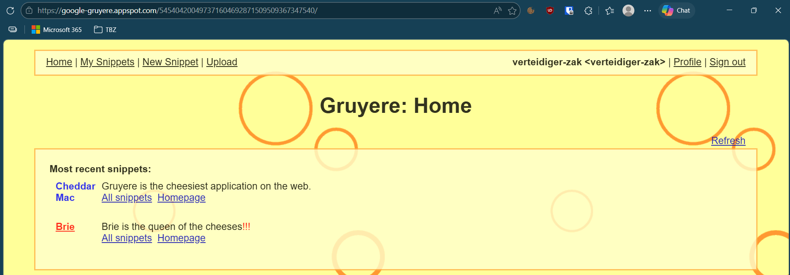
- Users
    - angreifer-zakria: gugus1 
    - verteidiger-zak: gugus2 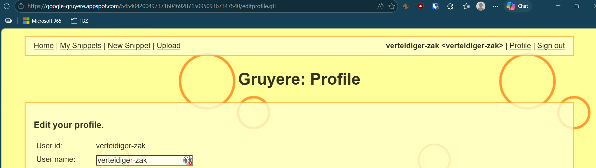
### B) Stored XSS in Gruyere
#### B1 – DOM-Manipulation als Proof of Concept
- injects script when creating new snippet: `` 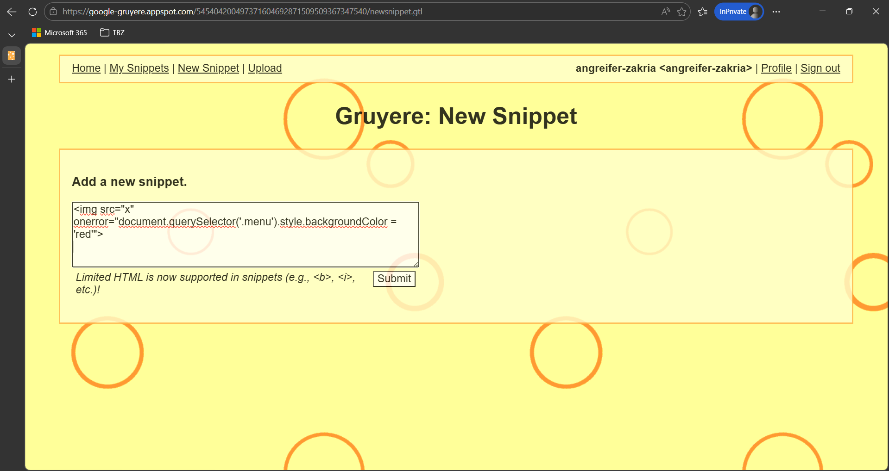 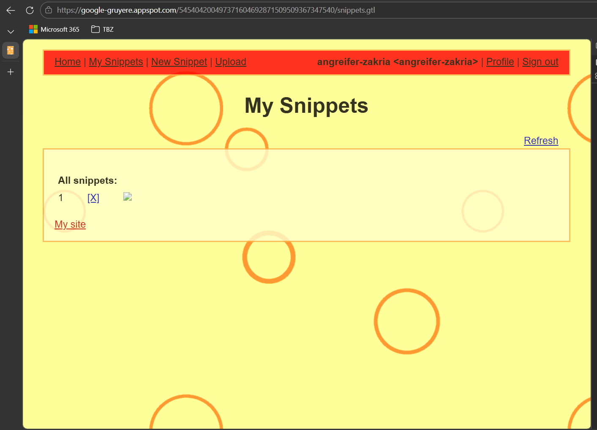 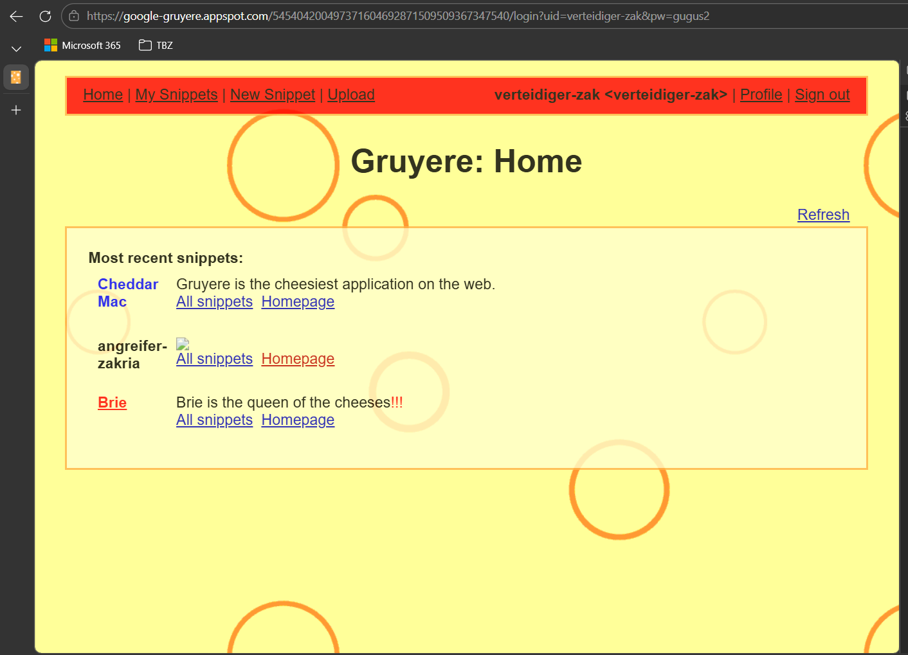
- Q&A
    - *Warum konnte dieser Payload die Sicherheitsprüfung des Browsers umgehen, obwohl <script> blockiert wird?*
    - It took advantage of the [`onerror` event handler](https://www.w3schools.com/Jsref/event_onerror.asp), wich is triggered when an error occurs while loading an external file. Since I'm asking for an image that's most likely not to exist, the `onerror` event will be triggered, allowing the execution of the JavaScript code.
    - *Was bedeutet es für die Sicherheit, dass der Payload auch im Browser des Verteidigers ausgeführt wird?*
    - It means that the attacker can manipulate the victim's browser, potentially leading to data theft or session hijacking of the website.
    - *Welche OWASP Top 10 Kategorie (2025) beschreibt Stored XSS? Nennen Sie Nummer und Bezeichnung.*
    - [A05:2025 Injection](https://owasp.org/Top10/2025/A05_2025-Injection/)
    - *Was hätte die Applikation tun müssen, damit dieser Payload harmlos bleibt? (Stichwort: Output Encoding)*
    - The application should have properly encoded the output, especially for special characters like `<`, `>`, and `&`. This would prevent the browser from interpreting the input as executable code, making it harmless. [output encoding](https://cheatsheetseries.owasp.org/cheatsheets/Cross_Site_Scripting_Prevention_Cheat_Sheet.html#output-encoding)
#### B2 – Cookies: Was sie sind und warum sie gefährlich sind
- Cookie
    - GRUYERE: 45075654|verteidiger-zak||author
- Inject script `Sichtbares Cookie: ' + document.cookie + '</div>')">` 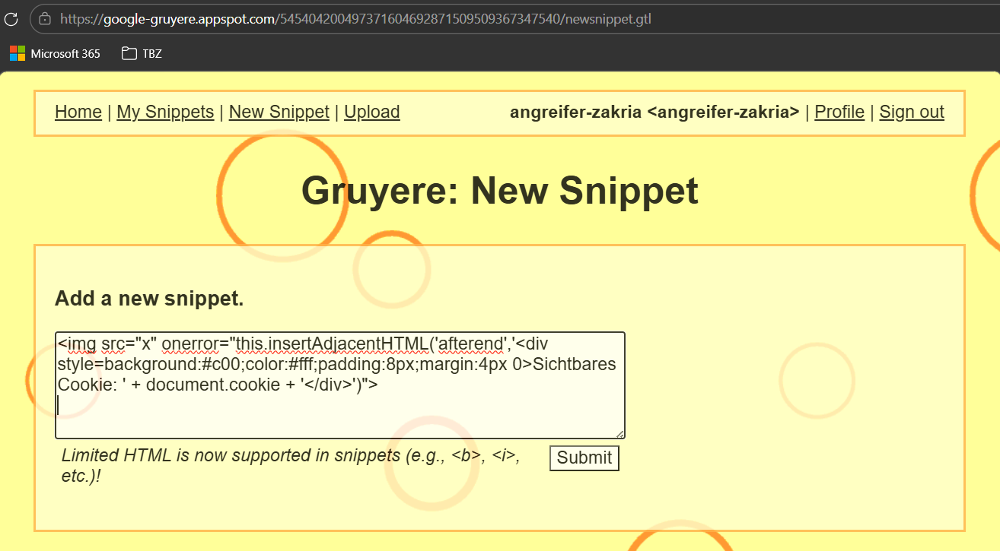
- Q&A
- *Laden Sie die Seite neu. Wessen Cookie wird im roten Kasten angezeigt – Ihrer oder der des Verteidigers?*
- The attacker's cookie is displayed in the red box, because the script is executed in the attacker's browser. 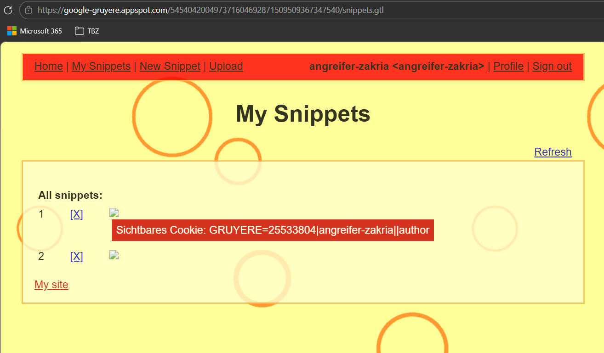
- *Wechseln Sie zum Fenster des Verteidigers und navigieren Sie zur Startseite. Welches Cookie erscheint dort?* 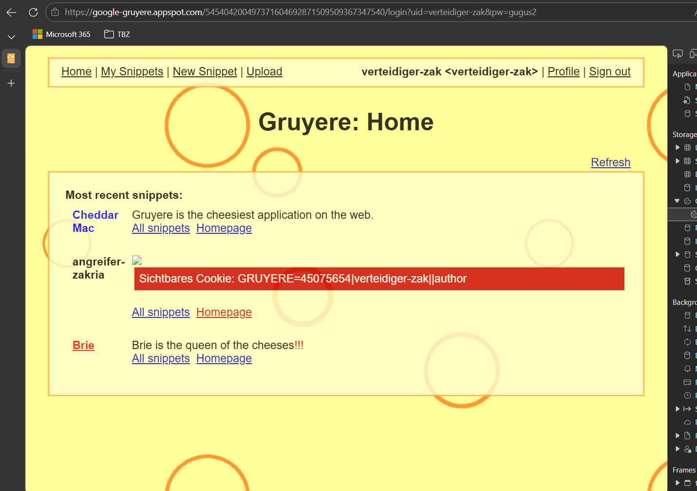
- *Was kann ein Angreifer tun, wenn er den Session-Cookie eines anderen Benutzers kennt?*
- If an attacker knows the session cookie of another user, they can impersonate that user by using the stolen cookie. They can do this by setting their own browser's cookie to the stolen value, allowing them to access the victim's account.
- *Was bewirkt das HttpOnly-Flag bei einem Cookie und wie schützt es vor diesem Angriff?*
-  When this flag is present, browsers that support it keep the cookie out of JavaScript APIs such as document.cookie. Since scripts running in the browser are not able to read its value, this makes it harder for many XSS attacks to steal session cookies or other sensitive data stored in cookies. [httpOnly](https://owasp.org/www-community/HttpOnly)
- *Warum ist es gefährlich, Session-Cookies im localStorage statt in einem HttpOnly-Cookie zu speichern?*
- Storing session cookies in localStorage is dangerous because localStorage is accessible via JavaScript
#### B3 – Session-Hijacking: Cookie-Exfiltration zum Angreifer-Server
- Generate SHH key pair. 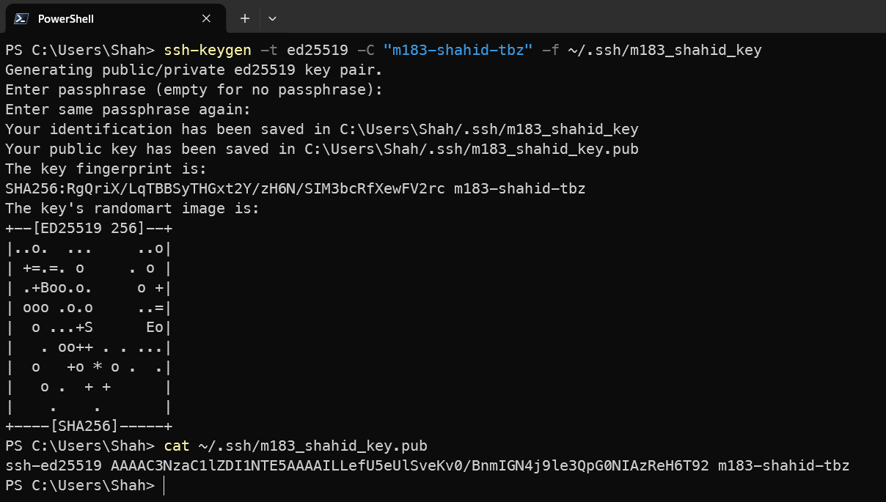
- Passkey: gugus
- Create Security Group: 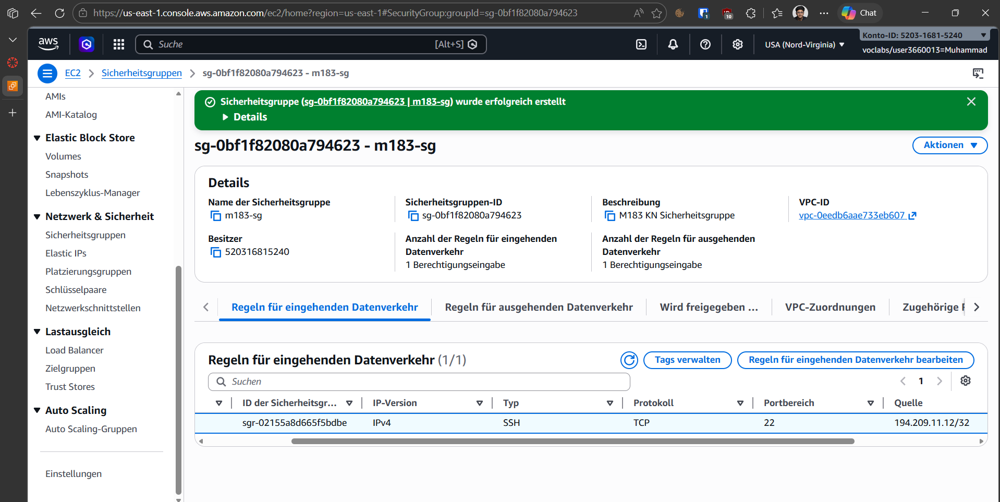
- Cloud Init script:
```yaml
#cloud-config
users:
  - name: ubuntu
    groups: docker
    sudo: ALL=(ALL) NOPASSWD:ALL
    shell: /bin/bash
    ssh_authorized_keys:
      - ssh-ed25519 AAAAC3NzaC1lZDI1NTE5AAAAILLefU5eUlSveKv0/BnmIGN4j9le3QpG0NIAzReH6T92 m183-shahid-tbz

packages:
  - docker.io

runcmd:
  - systemctl start docker
  - systemctl enable docker
```
- Public IPv4 (will change on every reboot, should use Elastic IP): `35.153.157.12`
- Connect to EC2 instance: 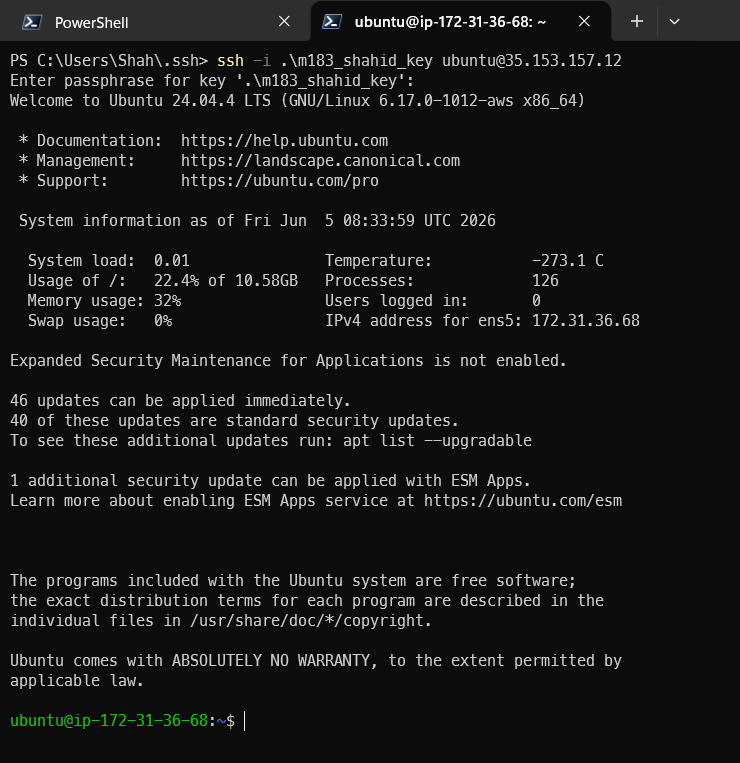
- Testing Docker: 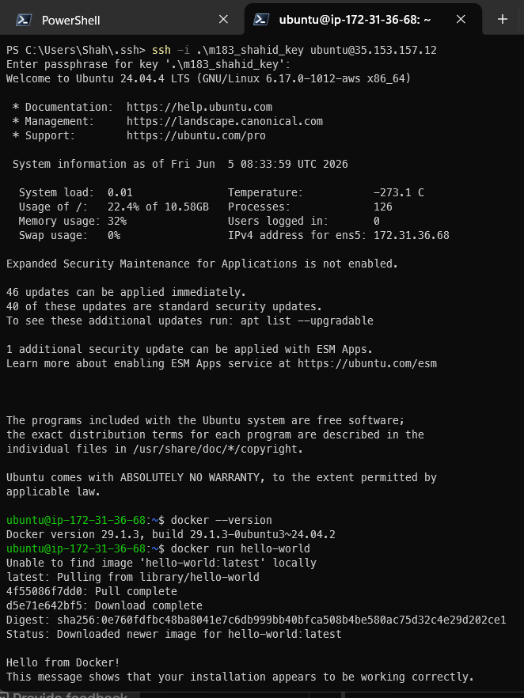
- Open Port:9000 in security group `m183-sg`. 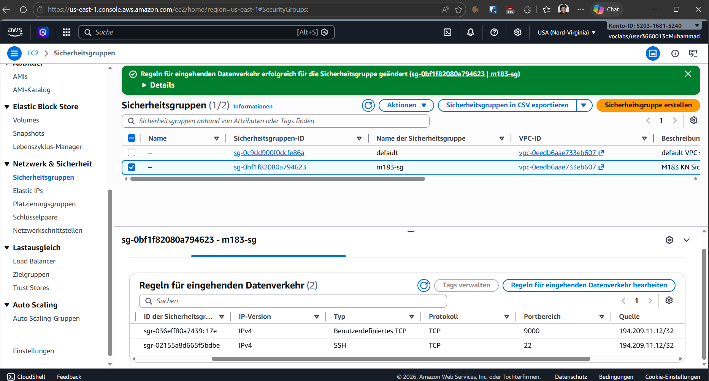
- Start Attack Server (SSH-Terminal 1)
    - run script: `python3 -m http.server 9000` → simple Python-HTTP-Server running on port 9000
- Start HTTPS-Tunnel Server (SSH-Terminal 2)
    - run script: `ssh -R 80:localhost:9000 serveo.net` → binds all incoming traffic on port 80 of serveo.net to port 9000 of the attacker's EC2 instance
    - copy log: `Forwarding HTTP traffic from https://59614f9c88d865c5-35-153-157-12.serveousercontent.com`
- Create Snippet on Attackers account on Gruyere:
    - enter this into input field: `` → now this runs a GET request to the attacker's server with the cookie as url parameter, and the user won't notice this.
    - It didn't log anything since the request kept failing, I believe it's due to my Firewall blocking the outgoing request
    - I tested it on my personal computer and it worked, but I also had to disable the buffer by running `python3 -u -m http.server 9000`. 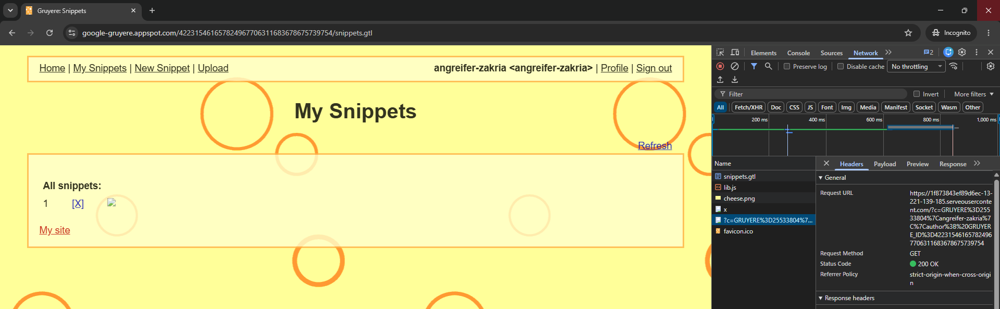 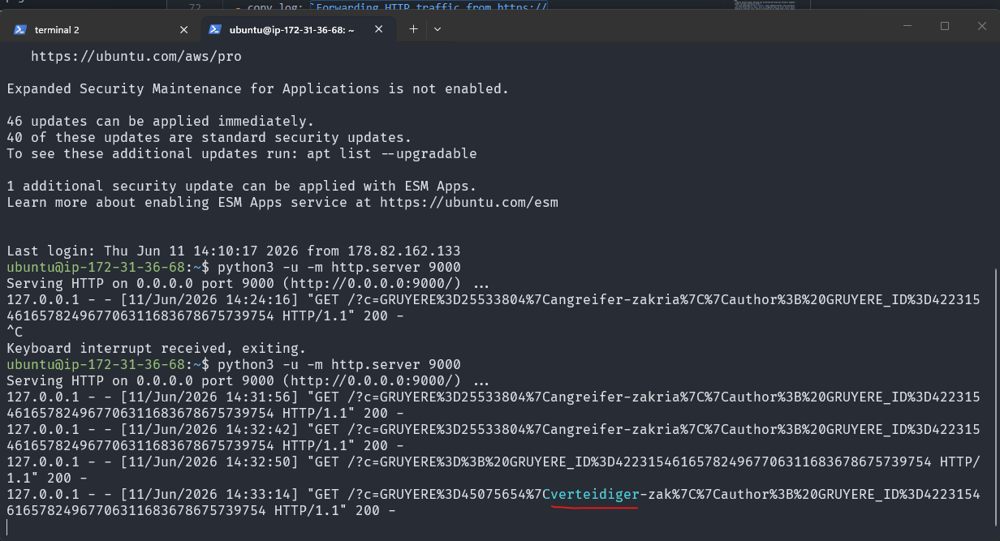
    - then I had hijack the verteidiger-zak's session by setting the cookie in my browser to the stolen value. 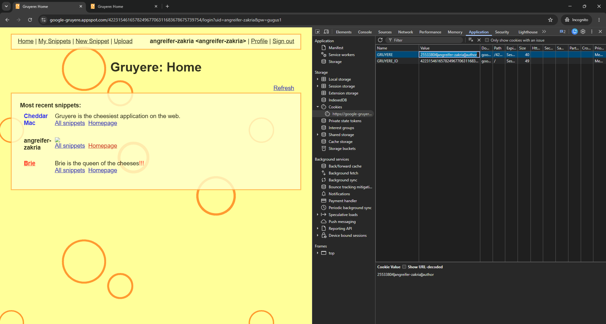 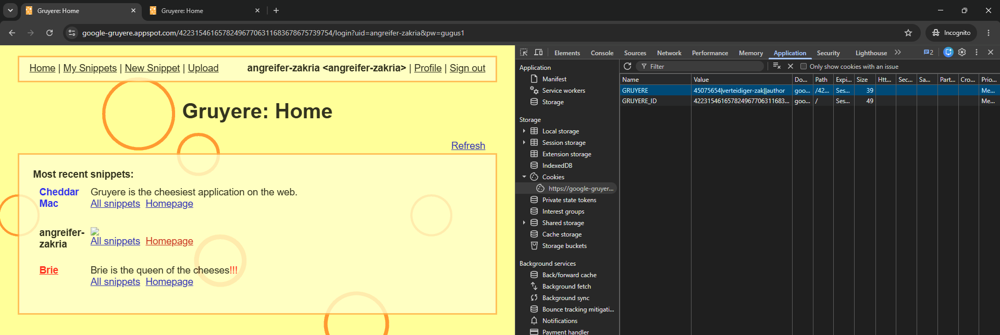 and it worked 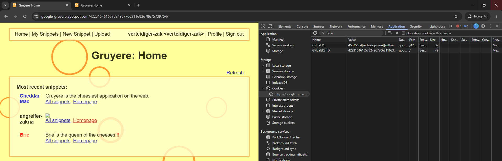
- Q&A
- Warum konnte der Angreifer den Cookie des Verteidigers erhalten, ohne je dessen Passwort zu kennen oder Zugriff auf dessen Browser zu haben?
- because on the same UID if I change the cookie in my browser, it will be the same for the victim's browser, since they are on the same UID.
- Welche Rolle spielt der new Image().src-Trick – warum funktioniert diese Technik trotz Same-Origin-Policy?
- when image.src fails then onerror event is triggered, and the code in onerror is executed. Since the request is a simple GET request, it is not blocked by the Same-Origin-Policy.
- Warum war der Serveo-Tunnel notwendig – was wäre passiert, wenn der Payload direkt http://<EC2-IP>:9000 verwendet hätte?
- probably because of the protocol, since serveo.net provides an HTTPS endpoint, the request is not blocked by the browser.
- Nennen Sie mindestens zwei technische Massnahmen, mit denen die Webapplikation diesen Angriff verhindert hätte.
- Using HttpOnly cookies would have prevented this attack, since the malicious script would not have been able to access the cookie value. Also Encoding the output properly would have prevented the attack, since the script would not have been executed in the first place.
- Was bewirkt das Secure-Flag bei einem Cookie, und in welcher Situation schützt es?
### C) Reflected XSS in Gruyere
- note UID (User ID)
- go through each Gruyere page and check for vulnerabilities, especially in the URL parameters, query parameters in GET requests.
- test vulnerabilities by changing requests parameter values and check response. 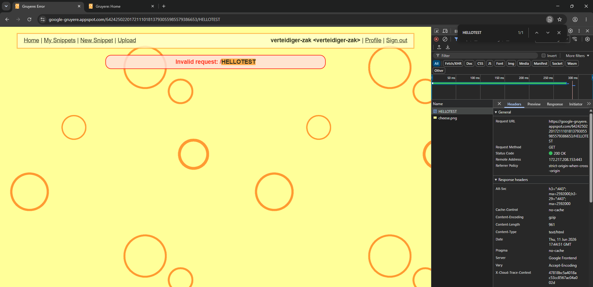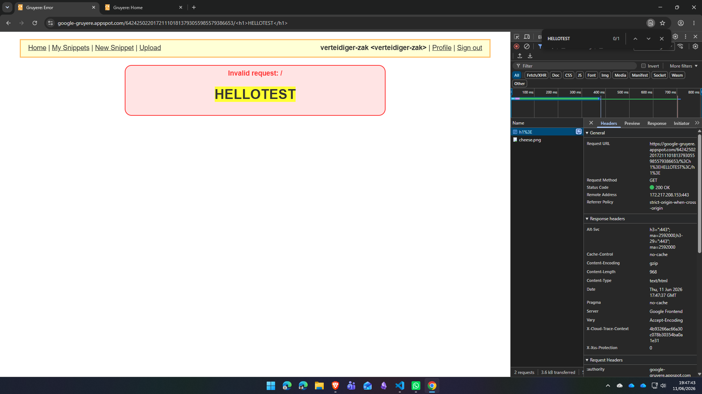
- I changed the url params witha script → `https://google-gruyere.appspot.com/642425022017211101813793055985579386653/` and it worked :O 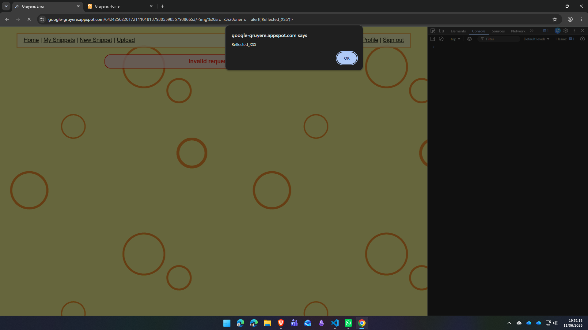 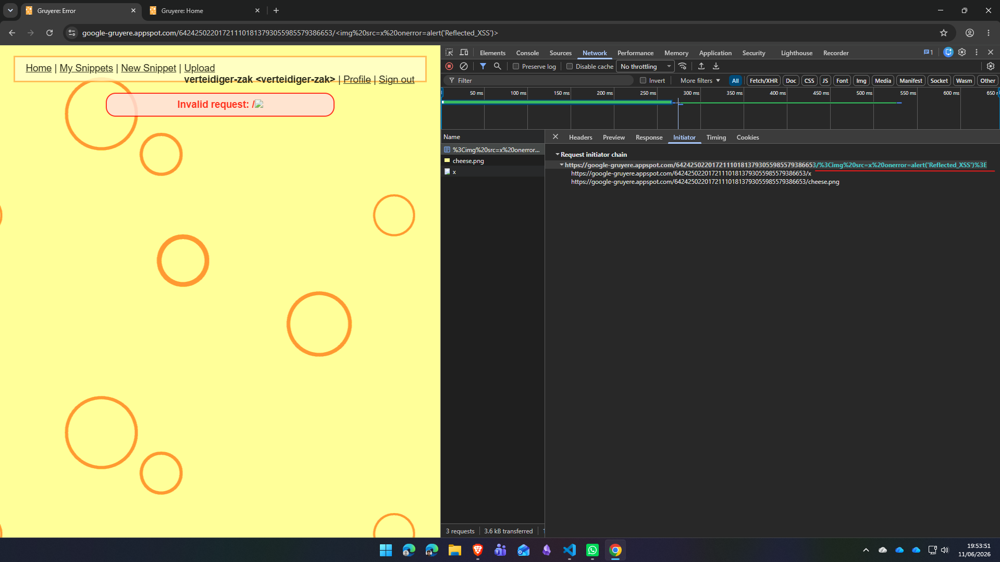
- Q&A
- Was ist der Hauptunterschied zwischen Stored XSS und Reflected XSS hinsichtlich Persistenz und Reichweite? (Antwort aus Schritt 3 ableiten)
- Stored XSS is persistent and can affect multiple users, while Reflected XSS is non-persistent and typically affects only the user who clicks on the vulnerable link.
- Wie würde ein Angreifer in der Praxis vorgehen, um das Opfer dazu zu bringen, den manipulierten Link zu öffnen? (Social Engineering)
- pishing emails, documents, links online etc... (usually with a URL shortener to hide the malicious URL)
- Welcher OWASP Proactive Control schützt am direktesten gegen XSS? Nennen Sie ihn mit Nummer und Titel. (Referenz: owasp.org/www-project-proactive-controls)
- [OWASP ASVS: V5 Input Validation and Encoding](https://owasp.org/www-project-application-security-verification-standard/)
### D) Client-State Manipulation in Gruyere
- cahnge user type in cookie to admin: `45075654|verteidiger-zak||admin` 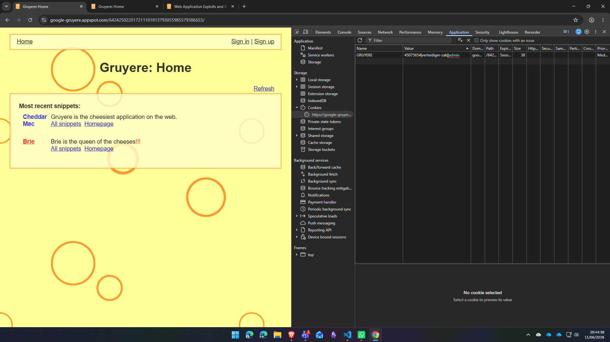
- Q&A
- Warum ist es gefährlich, sicherheitsrelevante Daten (wie Rollen oder Berechtigungen) im Client (Cookie/LocalStorage) zu speichern?
- if you only rely on client-side data for security and authorization, an attacker can easily manipulate this data to gain unauthorized access.
- Wo sollten Berechtigungsprüfungen stattfinden – im Client oder auf dem Server? Begründen Sie.
- Authorization checks should always take place on the server, because the client can be easily manipulated by an attacker.
- Welche OWASP Top 10 Kategorie (2025) beschreibt dieses Problem? [A01:2025 Broken Access Control](https://owasp.org/Top10/2025/A01_2025-Broken_Access_Control/)
