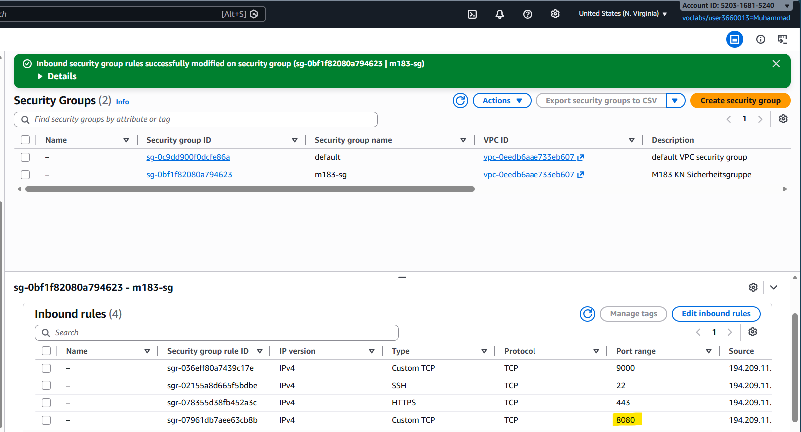
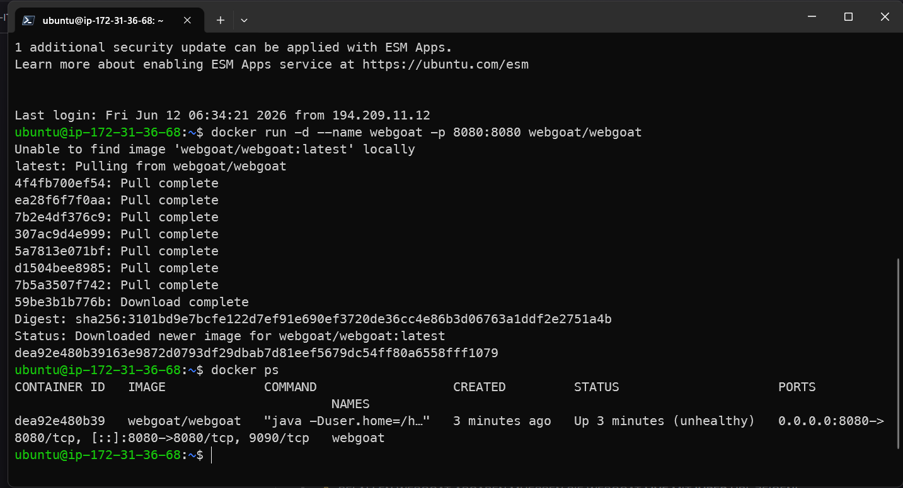
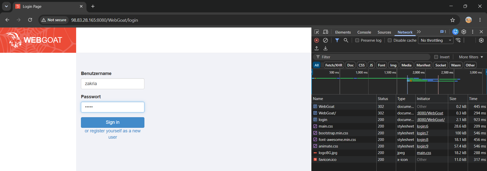

# KN-Webgoat-01: OWASP Top 10 – WebGoat
Lernziele
- Sie können SQL-Injection-Angriffe durchführen und die Gegenmassnahme (Prepared Statements) erklären.
- Sie können Reflected und Stored XSS in einer Webapplikation ausnutzen und den Unterschied erklären.
- Sie können einen CSRF-Angriff konzipieren und eine funktionsfähige Angriffs-HTML-Seite erstellen.
- Sie können Broken Access Control (IDOR) in einer Applikation nachweisen und serverseitige Autorisierung erklären.
- Sie können die Struktur eines JWT-Tokens analysieren und die alg:none-Schwachstelle ausnutzen.
- Sie können zu jeder Schwachstelle die passende OWASP Top 10 Kategorie benennen.
***
### A) WebGoat starten (Pflicht, zuerst lösen) (10%)
- Edit inbound rules and add a new rule to allow TCP port 8080 (WebGoat) 
- Start WebGoat in the EC2 instance in docker: `docker run -d --name webgoat -p 8080:8080 webgoat/webgoat` 
- Check if WebGoat is running: `docker ps`and visit `http://<EC2-Public-IP>:8080/WebGoat` in your browser. 
- Create new User → `zakria:gugus_` 
### B) SQL Injection (18%)
#### B1 – Login Bypass
- go to through the A3 SQL Injection lesson in WebGoat until the login bypass task.
  - 2: `SELECT department FROM employees WHERE first_name = 'Bob' AND last_name = 'Franco'`
  - 3: `UPDATE employees SET department='Sales' WHERE first_name='Tobi' AND last_name='Barnett'`
  - 4: `ALTER TABLE employees ADD phone varchar(20)`
  - 5: `GRANT ALL ON grant_rights TO unauthorized_user`
  - 9: `SMITH' or '1'='1`
  - 10: `1` & `1 OR 1=1`
- use name in first form field, and this payload `' OR '1'='1` in the second form field. 
#### B2 – Query Chaining: Integrität kompromittieren
- do the 12th (Compromising Integrity with Query chaining) task in the A3 SQL Injection lesson.
- payload: `3SL99A'; UPDATE employees SET salary=100000 WHERE userid=37648;`. with the `'` i close the first select query, then with `;` I start a new query. 
- Q&A
- Zeichnen Sie auf, wie das SQL-Statement aus B1 vor und nach dem Einschleusen des Payloads aussieht. Erklären Sie, warum die Authentifizierung dadurch umgangen wird.
- I was able to get all employees by setting a tricky payload `' OR '1'='1`, here the `'` closes the first string, then `OR '1'='1` is always true. wich means that the query will return all employees, since the condition is always true.
- Wie funktionieren Prepared Statements (parameterisierte Abfragen) technisch? Warum kann SQL Injection damit nicht mehr funktionieren?
- The're are two steps, prepare (1) → query is sent to server, but not executed yet, the server parses, compiles and optimizes the query without executing it. execute (2) → the application binds the parameters and the query is executed. since the parameters are sent separately, they cannot interfere with the query structure, which means that SQL Injection cannot work. [W3Schools](https://www.w3schools.com/sql/sql_prepared_statements.asp).
- Welche OWASP Top 10 Kategorie (2025) beschreibt SQL Injection? Nennen Sie Nummer und Bezeichnung.
- [A05:2025 Injection](https://owasp.org/Top10/2025/A05_2025-Injection/)
- Nennen Sie neben SQL Injection zwei weitere Injection-Varianten (z.B. OS Command Injection, LDAP Injection) und beschreiben Sie kurz, was dabei injiziert wird und wo die Gefahr liegt.
- OS Command Injection → you send script through the sql query wich opens the terminal on the sql server, and you can execute commands on the server.
- LDAP Injection → you send malicious LDAP statements through the sql query, this way you can manipulate the LDAP and give yourself access (through roles manipulation) to the system.
### C) Cross-Site Scripting (XSS) (18%)
#### C1 – Reflected XSS & DOM-based XSS
##### C1a – Try It! Reflected XSS
