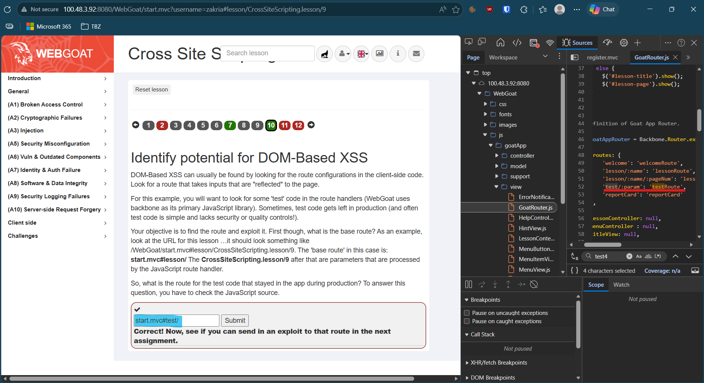
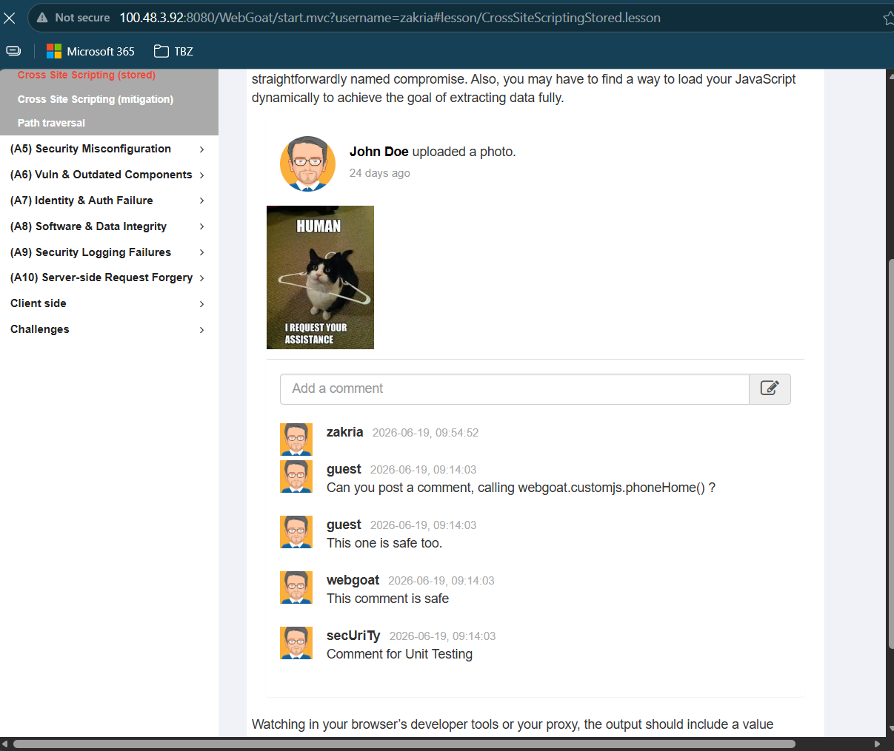

# KN-Webgoat-01: OWASP Top 10 – WebGoat
Lernziele
- Sie können SQL-Injection-Angriffe durchführen und die Gegenmassnahme (Prepared Statements) erklären.
- Sie können Reflected und Stored XSS in einer Webapplikation ausnutzen und den Unterschied erklären.
- Sie können einen CSRF-Angriff konzipieren und eine funktionsfähige Angriffs-HTML-Seite erstellen.
- Sie können Broken Access Control (IDOR) in einer Applikation nachweisen und serverseitige Autorisierung erklären.
- Sie können die Struktur eines JWT-Tokens analysieren und die alg:none-Schwachstelle ausnutzen.
- Sie können zu jeder Schwachstelle die passende OWASP Top 10 Kategorie benennen.
***
### A) WebGoat starten (Pflicht, zuerst lösen) (10%)
- Edit inbound rules and add a new rule to allow TCP port 8080 (WebGoat) 
- Start WebGoat in the EC2 instance in docker: `docker run -d --name webgoat -p 8080:8080 webgoat/webgoat` 
- Check if WebGoat is running: `docker ps`and visit `http://<EC2-Public-IP>:8080/WebGoat` in your browser. 
- Create new User → `zakria:gugus_` 
### B) SQL Injection (18%)
#### B1 – Login Bypass
- go to through the A3 SQL Injection lesson in WebGoat until the login bypass task.
  - 2: `SELECT department FROM employees WHERE first_name = 'Bob' AND last_name = 'Franco'`
  - 3: `UPDATE employees SET department='Sales' WHERE first_name='Tobi' AND last_name='Barnett'`
  - 4: `ALTER TABLE employees ADD phone varchar(20)`
  - 5: `GRANT ALL ON grant_rights TO unauthorized_user`
  - 9: `SMITH' or '1'='1`
  - 10: `1` & `1 OR 1=1`
- use name in first form field, and this payload `' OR '1'='1` in the second form field. 
#### B2 – Query Chaining: Integrität kompromittieren
- do the 12th (Compromising Integrity with Query chaining) task in the A3 SQL Injection lesson.
- payload: `3SL99A'; UPDATE employees SET salary=100000 WHERE userid=37648;`. with the `'` i close the first select query, then with `;` I start a new query. 
- Q&A
- Zeichnen Sie auf, wie das SQL-Statement aus B1 vor und nach dem Einschleusen des Payloads aussieht. Erklären Sie, warum die Authentifizierung dadurch umgangen wird.
- I was able to get all employees by setting a tricky payload `' OR '1'='1`, here the `'` closes the first string, then `OR '1'='1` is always true. wich means that the query will return all employees, since the condition is always true.
- Wie funktionieren Prepared Statements (parameterisierte Abfragen) technisch? Warum kann SQL Injection damit nicht mehr funktionieren?
- The're are two steps, prepare (1) → query is sent to server, but not executed yet, the server parses, compiles and optimizes the query without executing it. execute (2) → the application binds the parameters and the query is executed. since the parameters are sent separately, they cannot interfere with the query structure, which means that SQL Injection cannot work. [W3Schools](https://www.w3schools.com/sql/sql_prepared_statements.asp).
- Welche OWASP Top 10 Kategorie (2025) beschreibt SQL Injection? Nennen Sie Nummer und Bezeichnung.
- [A05:2025 Injection](https://owasp.org/Top10/2025/A05_2025-Injection/)
- Nennen Sie neben SQL Injection zwei weitere Injection-Varianten (z.B. OS Command Injection, LDAP Injection) und beschreiben Sie kurz, was dabei injiziert wird und wo die Gefahr liegt.
- OS Command Injection → you send script through the sql query wich opens the terminal on the sql server, and you can execute commands on the server.
- LDAP Injection → you send malicious LDAP statements through the sql query, this way you can manipulate the LDAP and give yourself access (through roles manipulation) to the system.
### C) Cross-Site Scripting (XSS) (18%)
#### C1 – Reflected XSS & DOM-based XSS
##### C1a – Try It! Reflected XSS
- I had to test the input field, to check if they were vulnerable to XSS, I tried to inject a simple script `` and it worked, the alert popped up. 
##### C1b – Identify potential for DOM-Based XSS
- Now i had to find a potential for DOM-Based XSS, which was finding a test route that stayed in the app during production. 
- Thne I had to use that exploit, since the app was vulnerable to XSS, I could inject a script in the URL, which would be executed when the page was loaded.  
#### C2 – Stored XSS
- Here the first task was to paste a script in the input field for the post comments ``. . The goal was to check if the script was called when the page was loaded. 
- Q&A
- Was ist der zentrale Unterschied zwischen Reflected XSS und Stored XSS hinsichtlich Persistenz und Reichweite? 
- Reflected XSS is not persistent, it only affects the user who clicks on the malicious link, while Stored XSS is persistent, it affects all users who visit the page where the malicious script is stored.
- Was unterscheidet DOM-based XSS von Reflected XSS – warum ist DOM-based XSS für serverseitige Filter schwieriger zu erkennen?
- DOM-based XSS is executed on the client side, which means that the malicious script is executed in the user's browser, not on the server. This makes it harder for server-side filters to detect and prevent it, as the malicious code is not sent to the server for processing.
- Was bedeutet Output Encoding und warum schützt es gegen XSS? Geben Sie ein konkretes Beispiel, wie <script> nach dem Encoding aussieht.
- Output Encoding is the process of converting special characters in [html entity](https://www.w3schools.com/html/html_entities.asp). For example, `<script>` becomes `&lt;script&gt;`. This prevents the browser from interpreting the characters as HTML or JavaScript, thus protecting against XSS attacks.
- Was ist der HTTP-Header Content-Security-Policy (CSP) und wie schränkt er XSS ein? (Recherchieren Sie falls nötig.)
- [Content-Security-Policy (CSP)](https://developer.mozilla.org/en-US/docs/Web/HTTP/Guides/CSP) is a security feature that allows web developers to control the resources that a web page can load. For example, a CSP header might specify that only scripts from the same origin or specific trusted domains can be executed, thus mitigating the risk of XSS.
- Welche OWASP Top 10 Kategorie (2021) beschreibt XSS? Nennen Sie Nummer und Bezeichnung.
- [A05:2025 Injection](https://owasp.org/Top10/2025/A05_2025-Injection/#:~:text=CWE%2D80%20Improper%20Neutralization%20of%20Script%2DRelated%20HTML%20Tags%20in%20a%20Web%20Page%20(Basic%20XSS)
### D) CSRF – Cross-Site Request Forgery (18%)
