# KN03: Sessionhandling & Authentifizierung absichern
- Lernziele:
  - Sie können eine laufende PHP-Applikation auf Sicherheitslücken im Sessionhandling analysieren. 
  - Sie können eine Session-Fixation-Schwachstelle erkennen und mit session_regenerate_id() beheben. 
  - Sie können Passwörter korrekt mit password_hash() (Argon2ID) hashen. 
  - Sie können Session-Cookies mit den Flags HttpOnly, Secure und SameSite absichern. 
  - Sie können die vier Authentifizierungsfaktor-Kategorien (Wissen, Besitz, Inhärenz, Ort) erklären und von MFA abgrenzen.
### A) Sicherheitsgruppe erweitern und App deployen
- first thing was to allow port `80` in the security group of the EC2 instance. This allows HTTP traffic to reach the application.
- Next, I had to download a git repository by running this:
```bash
cd ~
git clone https://gitlab.com/ch-tbz-it/Stud/m183/m183.git
```
- After that, I had to check for these three files `index.php`, `scripts.js` and `styles.css`. also found [here](https://gitlab.com/ch-tbz-it/Stud/m183/m183/-/tree/main/2%20Sessionhandling,%20Authentifizierung%20und%20Autorisierung/Sessionhandling/AufgabeSource?ref_type=heads) 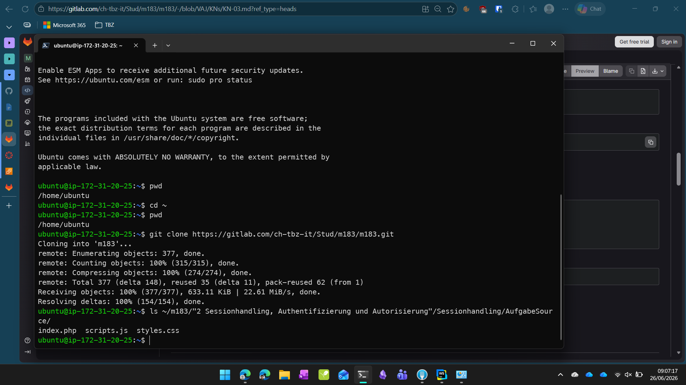
- Then I had to start a php container and connect the app files.
```bash
docker run -d \
  --name m183-session \
  -p 80:80 \
  -v ~/m183/"2 Sessionhandling, Authentifizierung und Autorisierung"/Sessionhandling/AufgabeSource:/var/www/html \
  php:8.2-apache
```
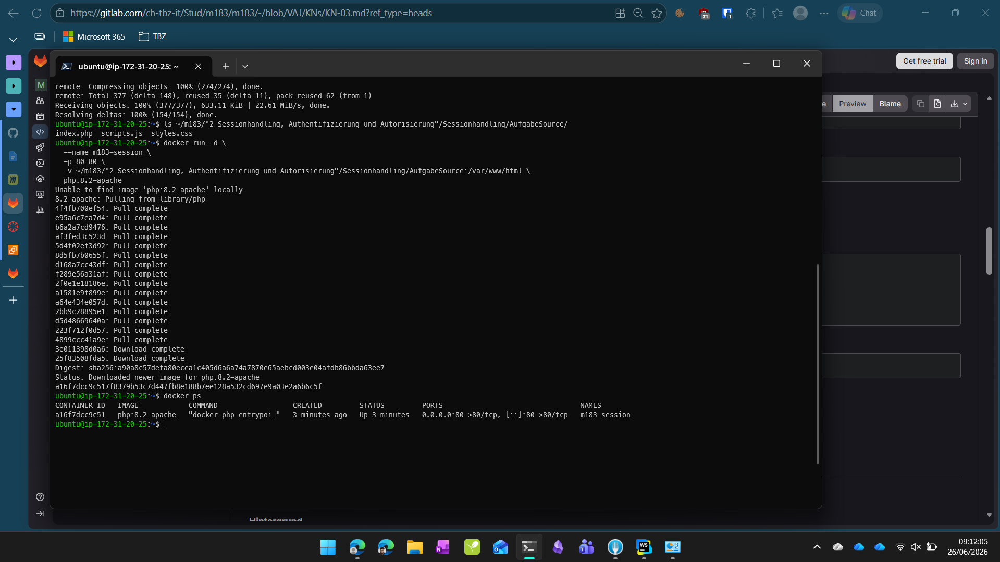
- To make sure it worked, I had to open the public IP of the EC2 instance in a web browser and check if the application was running. 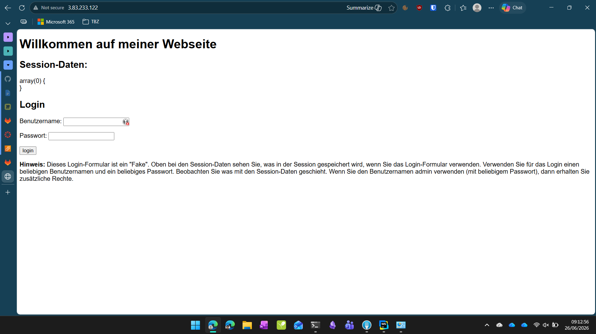
### B) Sicherheitslücken in der App analysieren
- Now I had to test/find the vulnerabilities in the application. I first logged in as `gugus:gugus` 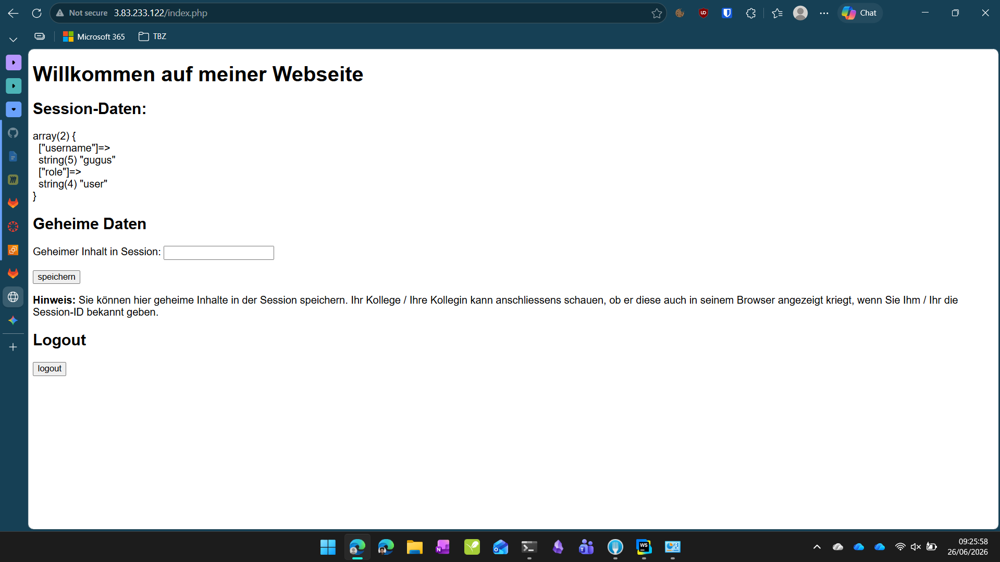
- I also tested the message function, by saving a `ciao` text as secret message and I noticed that I could see the session id in the network tab of the browser developer tools. 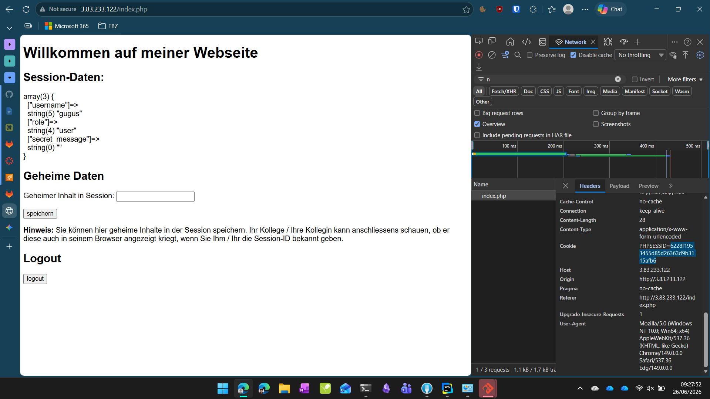
- Vulneribilities
  - No roles check, if user is named `admin` he is automatically assigned the admin role.
  - Payload info is shown clearly. like user, role and secret message.
  - Session: after login, the session id is not regenerated. So if two people share the same session id, and one of them login, the other just needs to refresh the page and he is logged in as the other user. 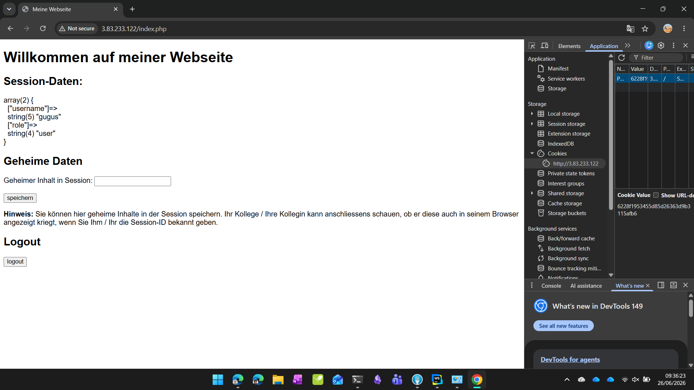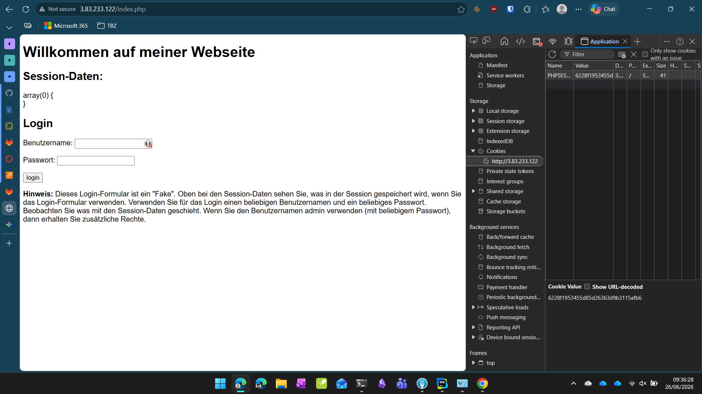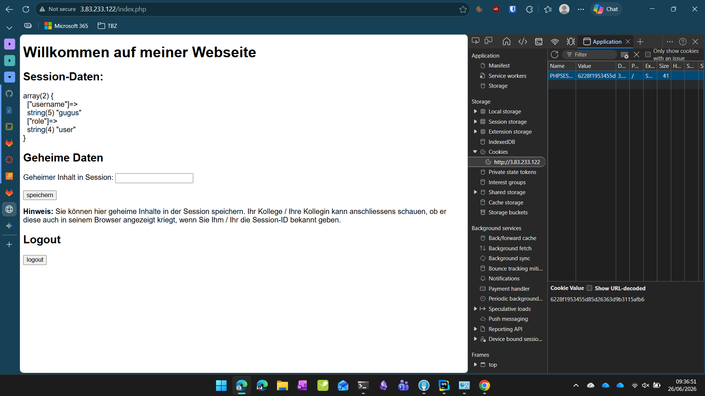
  - No Cookie protection: the session cookie is not set with the flags like `HttpOnly` 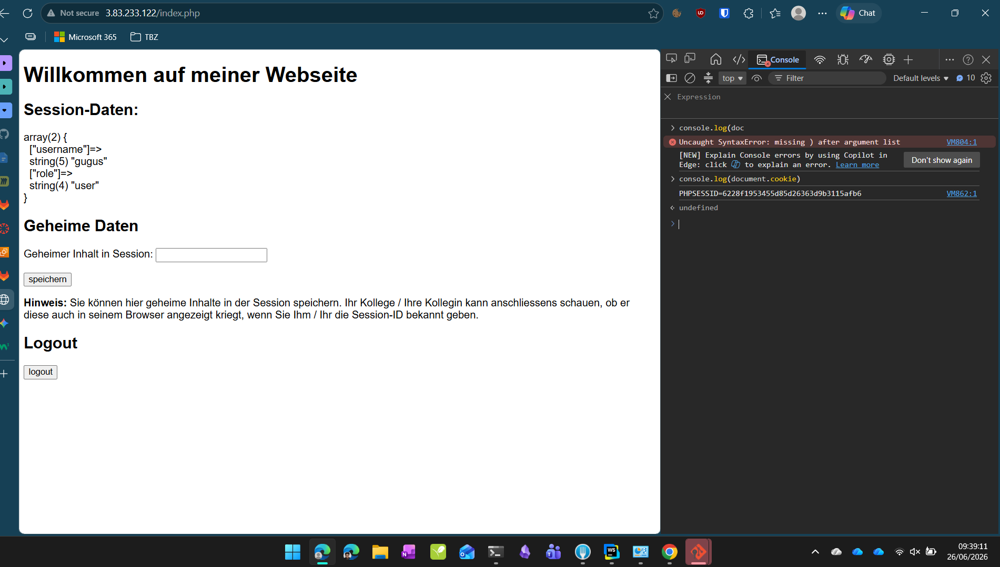
  - This all allows CSRF attacks, because the session cookie is not protected and the session id is not regenerated after login.
### C) Session-Fixation-Angriff demonstrieren
- I already did this in the previous step, by logging in as `gugus` and then sharing the session id with another person.
- Q&A
- Welche eine Massnahme hätte diesen Angriff verhindert?
- By regenerating the session id after login, using `session_regenerate_id()`, the session fixation attack could have been prevented.
### D) Sicherheitslücken beheben
- now I had to duplicate the `index.php` file and implement the security fixes.
```bash
cp ~/m183/"2 Sessionhandling, Authentifizierung und Autorisierung"/Sessionhandling/AufgabeSource/index.php \
   ~/m183/"2 Sessionhandling, Authentifizierung und Autorisierung"/Sessionhandling/AufgabeSource/index_original.php
```
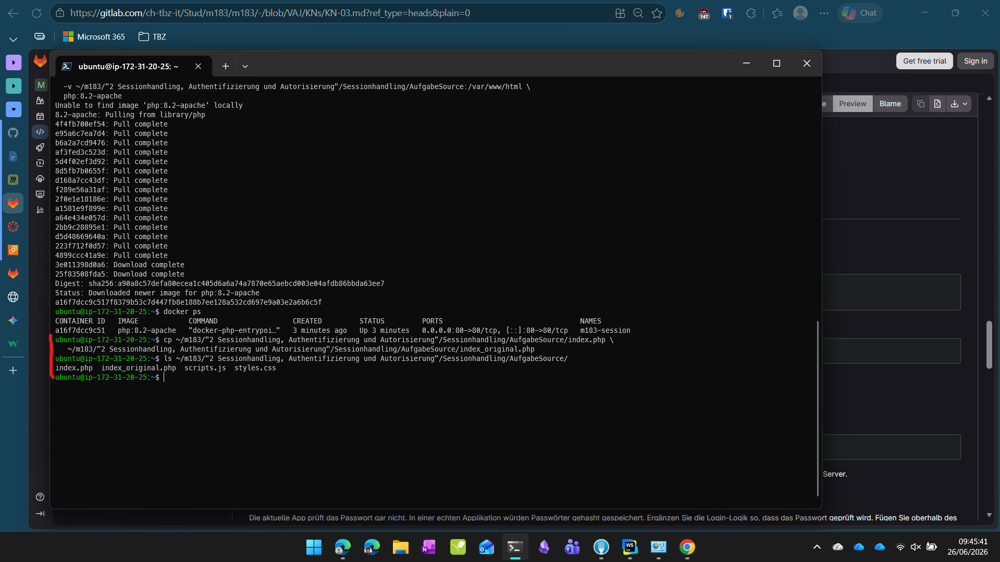
- After making the changes, now the session id was regenerated after login, and the session cookie was set with the flags `HttpOnly` and `Secure`. 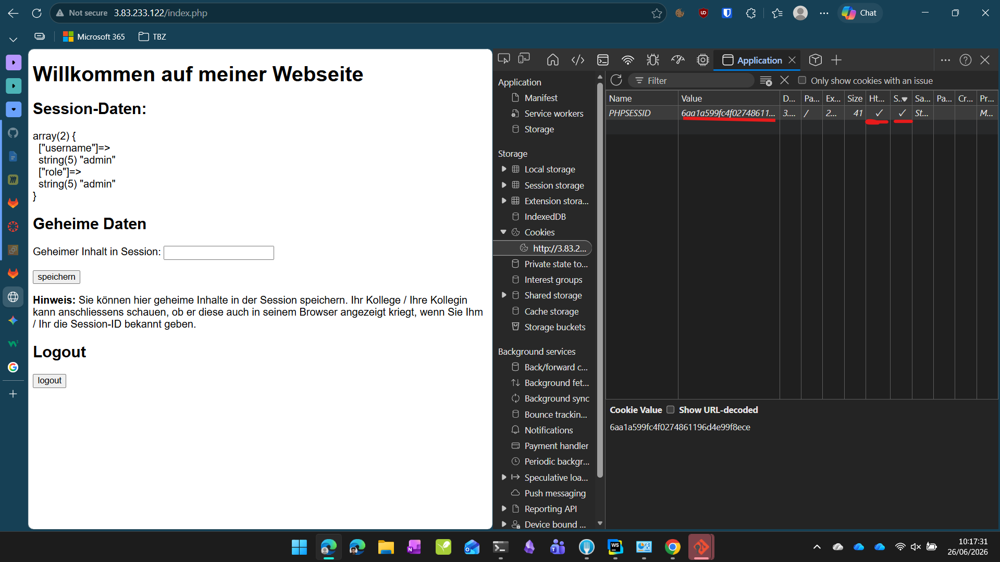
- Q&A
- Was bewirkt SameSite=Strict? Gegen welchen Angriff schützt dieses Flag?
- with `SameSite=Strict`, the browser will not send the cookie along with requests initiated by third party websites. This helps to prevent CSRF attacks. [source](https://stackoverflow.com/questions/61776033/what-is-difference-between-samesite-lax-and-samesite-strict-in-receiving-cookies)
- Warum wurde password_hash() mit PASSWORD_ARGON2ID und nicht mit MD5 oder SHA-1 verwendet?
- for brute force attacks, Argon2ID is more secure than MD5 or SHA-1. so if an attacker tries to brute force the password, it will take a lot more time and resources to crack the password hash.
### E) MFA-Faktoren erklären
| Kategorie | Beschreibung | Beispiel 1 | Beispiel 2 |
|-----------|-------------|------|----|
| **Wissen** | Etwas das Sie wissen | Passwort | PIN| 
| **Besitz** | Etwas das Sie besitzen | Smartphone | Token |
| **Inhärenz** | Etwas das Sie sind | Fingerprint | Face-Id |
| **Ort** | Wo Sie sich befinden | IP-Adresse | GPS/Standort |
- Q&A
- Ist die Kombination «Passwort + PIN» echtes MFA? Begründen Sie. 
- No, since both factors are from the same category (Wissen/Knowledge)
- Ist die Kombination «Passwort + SMS-Code» echtes MFA? Begründen Sie.
- Yes, because the factors are from different categories (Wissen/Knowledge and Besitz/Possession)
- AWS STS (Security Token Service) stellt temporäre Zugangsdaten aus. Welchem MFA-Prinzip ähnelt dieses Konzept am meisten, und warum? (Hinweis: Kapitel 2 Authentifizierung & Autorisierung → Temporäre Berechtigungen)
- This concept is most similar to the Besitz/Possession factor, because the temporary credentials are something that the user possesses and can use to access AWS resources for a limited time.